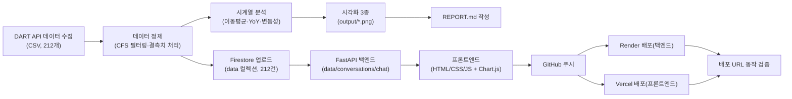
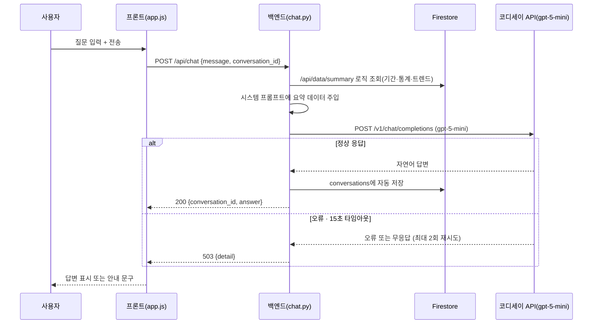

# 네이버 재무건전성 분석 AI 비서 💰

> 온라인 셀러가 네이버 스마트스토어 입점을 "감"이 아닌 데이터로 판단할 수 있도록,
> 네이버의 분기별 재무제표를 분석하고 AI 챗봇으로 질문에 답해주는 웹 서비스

**🔗 배포 URL (프론트):** https://m1-2-nine.vercel.app
**🔗 배포 URL (백엔드 API):** https://m1-2-xvcs.onrender.com/docs
**💻 GitHub:** https://github.com/ilililililil4319/M1-2
**📄 결과보고서:** [`docs/2_결과보고서_네이버_재무건전성_분석.md`](docs/2_결과보고서_네이버_재무건전성_분석.md)


---

## 목차

1. [프로젝트 소개](#1-프로젝트-소개)
2. [분석 질문 (3개 이상)](#2-분석-질문-3개-이상)
3. [프로젝트 개요 및 산출물 구성](#3-프로젝트-개요-및-산출물-구성)
4. [폴더 구조](#4-폴더-구조)
5. [기술 스택](#5-기술-스택)
6. [데이터 설명 및 출처](#6-데이터-설명-및-출처)
7. [분석 방법 및 인사이트 요약](#7-분석-방법-및-인사이트-요약)
8. [결론 및 한계점](#8-결론-및-한계점)
9. [전체 작업 순서 (STEP 1~19)](#9-전체-작업-순서-step-1-19)
10. [작업 흐름도](#10-작업-흐름도)
11. [코디세이 API 연동 구조 (AI 챗봇)](#11-코디세이-api-연동-구조-ai-챗봇)
12. [4대 화면 기능](#12-4대-화면-기능)
13. [보너스 기능](#13-보너스-기능)
14. [로컬 실행 방법](#14-로컬-실행-방법)
15. [배포 방법 및 환경 변수](#15-배포-방법-및-환경-변수)
16. [배포 중 발생한 오류와 해결](#16-배포-중-발생한-오류와-해결)
17. [AI(Claude) 사용 로그 요약](#17-aiclaude-사용-로그-요약)
18. [기능요구사항 대비 결과](#18-기능요구사항-대비-결과)
19. [자체 점검 체크리스트](#19-자체-점검-체크리스트)
20. [보안 유의사항](#20-보안-유의사항)
21. [데이터 출처 및 라이선스 유의사항](#21-데이터-출처-및-라이선스-유의사항)
22. [기타](#22-기타)

---

## 1. 프로젝트 소개

2024년 위메프·티몬(티메프) 정산 지연 사태로, 수많은 온라인 셀러들이 판매대금을 제때 받지 못하는 일을 겪었습니다. 플랫폼이 재무적으로 무너지고 있다는 신호는 사실 정산 지연이 뉴스로 터지기 전부터 재무제표 곳곳에 있었지만, 셀러 입장에서는 그 신호를 미리 확인할 방법도 습관도 없었습니다.

이 프로젝트는 국내 대표 오픈마켓 플랫폼인 **네이버**를 대상으로, 금융감독원 Open DART API에서 최근 6년(24개 분기)의 재무제표를 수집·정제·분석하여 성장성·수익성·안정성·현금창출력 지표의 추세를 파악하고, 이를 바탕으로 사용자의 질문에 답하는 **AI 챗봇 웹 서비스**를 구현한 개인 프로젝트입니다 (AI Native Master 미션과제 M1-2).

- **분석 대상:** 네이버(NAVER, 종목코드 035420) 분기별 재무제표 9개 지표 (2020~2025년, 212개)
- **핵심 가치:** 감이 아닌 "실제 재무 데이터"로 플랫폼 입점을 판단하고, AI 챗봇으로 쉽게 질의응답
- **4대 기능:** 데이터 기반 AI 채팅 / 데이터 관리(CRUD) / 대화 기록 저장·불러오기 / 요약 정보 표시
- **보너스:** 다크모드 토글, CSV/JSON 내보내기, 추가 시각화(안정성 지표 추이), 변동성(표준편차) 지표 확장

---

## 2. 분석 질문 (3개 이상)

1. 네이버의 성장성·수익성·안정성 지표는 지난 6년간 어떤 추세를 보였는가?
2. 안정성 지표(부채비율·유동비율)에 급격한 변화가 있었던 분기가 있으며, 어떤 이슈와 연결되는가?
3. 위메프 사태처럼 "정산 지연" 리스크를 미리 포착할 수 있는 재무적 신호(현금흐름 급감, 유동비율 하락 등)가 나타난 적이 있는가?

---

## 3. 프로젝트 개요 및 산출물 구성

| 항목 | 내용 |
|---|---|
| 과제명 | AI Agent 개발: 나만의 AI 비서 구축 (미션과제 M1-2) |
| 분석 주제 | 온라인 셀러를 위한 네이버 재무건전성 분석 AI 비서 |
| 작성 형태 | 개인 프로젝트 (1인 수행) |
| 사용 AI 도구 | Claude(Anthropic, 분석/코드 생성·디버깅·배포 보조), 코디세이 API `gpt-5-mini`(AI 챗봇 응답) |
| 보너스 과제 | 다크모드 토글, CSV/JSON 내보내기, 추가 시각화(안정성 지표), 변동성 지표 확장 |

**산출물 구성**

| 산출물 | 형식 | 위치 |
|---|---|---|
| 웹 서비스(백엔드) | FastAPI, Render 배포 | `backend/`, https://m1-2-xvcs.onrender.com |
| 웹 서비스(프론트엔드) | HTML/CSS/JS, Vercel 배포 | `frontend/`, https://m1-2-nine.vercel.app |
| 분석 리포트 | REPORT.md | 루트 |
| 기획서 | PDF + md | `docs/` |
| 결과보고서 | PDF + md | `docs/` |
| 분석 코드 | Jupyter Notebook | `notebook/prepare_data.ipynb` |
| 시각화 | PNG 3종 | `output/` |
| 증빙 스크린샷 | PNG 다수 | `screenshots/` |

---

## 4. 폴더 구조

README와 결과보고서가 어디에 있는지 먼저 확인하세요.

```
M1-2/
├── README.md                          ← 지금 보고 있는 파일
├── REPORT.md                          # 분석 리포트 (최종 결과물, Fact-Why-Action 구조)
├── .gitignore
│
├── data/
│   ├── naver_financials_raw.csv       # DART 원본 (728행)
│   └── naver_financials.csv           # 정제된 long format (212개)
│
├── docs/                              # 기획서 · 결과보고서 (PDF + md)
│   ├── 1_기획서_네이버_재무건전성_분석.pdf
│   ├── 1_기획서_네이버_재무건전성_분석.md
│   ├── 2_결과보고서_네이버_재무건전성_분석.pdf  ← 결과보고서는 여기
│   └── 2_결과보고서_네이버_재무건전성_분석.md   ← 결과보고서는 여기
│
├── notebook/
│   └── prepare_data.ipynb             # 데이터 수집부터 시각화까지 전체 분석 코드
│
├── output/                            # 시각화 결과 (PNG 3종)
│   ├── 01_revenue_profit_trend.png
│   ├── 02_stability_ratios.png
│   └── 03_operating_cashflow.png
│
├── screenshots/                       # 작업 과정 증빙 스크린샷 (86장 이상)
│
├── backend/                            # FastAPI 백엔드 (Render 배포 루트)
│   ├── main.py                        # 앱 진입점, 라우터 등록
│   ├── requirements.txt
│   ├── .env                           # 로컬 API 키 (git 제외 대상)
│   └── app/
│       ├── core/firebase.py           # Firestore 클라이언트 초기화
│       ├── models/schemas.py          # Pydantic 스키마
│       ├── routers/
│       │   ├── data.py                # 데이터 CRUD 5종
│       │   ├── conversations.py       # 대화 기록 CRUD 5종
│       │   └── chat.py                # AI 챗봇 엔드포인트
│       └── services/
│           ├── data_service.py        # Firestore 데이터 로직 + 요약 통계
│           └── conversation_service.py
│
└── frontend/                           # 바닐라 HTML/CSS/JS (Vercel 배포 루트)
    ├── index.html                     # 4대 화면(채팅/데이터관리/대화기록/요약표시)
    ├── style.css                      # 디자인 토큰 + 다크모드
    └── app.js                         # API 연동 + Chart.js 시각화 + 내보내기
```

---

## 5. 기술 스택

| 구분 | 내용 |
|---|---|
| 분석 환경 | Python 3.14, VS Code, Jupyter |
| 데이터 처리 | pandas, numpy, OpenDartReader |
| 시각화(분석) | matplotlib |
| 백엔드 | FastAPI, Pydantic, uvicorn |
| 데이터베이스 | Firebase Firestore |
| 프론트엔드 | HTML / CSS / JavaScript(바닐라), Chart.js(CDN) |
| AI 챗봇 API | 코디세이 API(`gpt-5-mini`, OpenAI 호환) |
| 배포 | Render(백엔드), Vercel(프론트엔드) |
| 버전관리 | Git / GitHub |
| 데이터 출처 | 금융감독원 전자공시시스템(DART) Open API |

---

## 6. 데이터 설명 및 출처

| 항목 | 내용 |
|---|---|
| 출처 | 금융감독원 Open DART API (OpenDartReader 라이브러리)<br/>https://opendart.fss.or.kr |
| 대상 기업 | 네이버(NAVER Corp, 종목코드 035420) — 연결재무제표(CFS) 기준 |
| 수집 기간 | 2020년 ~ 2025년 (24개 분기) |
| 원본 데이터 규모 | 728행 |
| 최종 데이터 규모 | 212개 (long format: date, value, memo) — 요구사항(100개 이상) 대비 2배 이상 |
| 분석 지표(9개) | 성장성: 매출액, 매출증가율(YoY) / 수익성: 영업이익, 영업이익률, 순이익률 /<br/>재무안정성: 부채비율, 유동비율, 자기자본비율 / 현금창출력: 영업활동현금흐름 |
| 원본 파일 | `data/naver_financials_raw.csv` |
| 정제 파일 | `data/naver_financials.csv` |

**DART에서 데이터를 수집한 과정**

| ① API 키 발급 | ② 재무제표 수집 | ③ 지표 추출·정제 |
|:---:|:---:|:---:|
|  |  |  |

1. Open DART(https://opendart.fss.or.kr) 접속 후 API 키 발급
2. `OpenDartReader`로 네이버(035420) 분기별 재무제표(재무상태표·손익계산서·현금흐름표) 수집
3. 연결재무제표(CFS) 필터링 → 9개 지표 계산 → long format(date, value, memo) 변환

**데이터 정제 결과**

| ① 결측치 처리 전 | ② 결측치 처리 후 |
|:---:|:---:|
|  |  |

- **결측치**: 영업활동현금흐름 2024년 1~3분기 결측(21개 → 24개) → **직전 분기값으로 대체(forward fill)**. 매출증가율(YoY)의 2020년 결측 4건은 비교할 전년 동기 데이터가 없는 자연스러운 결측이라 별도 보정 없이 제외.
- **이상치**: 레벨(금액) 값 자체에서는 통계적 이상치 없음. 다만 매출·영업이익은 분기 누적 공시 특성상 4분기마다 급증하는 패턴이 있는데, 이상치가 아니라 공시 구조에 따른 정상적 특성으로 확인(7장 인사이트 참고).

데이터 설명·정제 기준의 전체 근거는 [`REPORT.md`](./REPORT.md#3-데이터-설명)와 결과보고서에서 자세히 다룹니다.

---

## 7. 분석 방법 및 인사이트 요약

**적용한 시계열 기법 3가지**

| 기법 | 설명 |
|---|---|
| 4분기 이동평균(Moving Average) | 분기별 변동을 완만하게 하여 중장기 추세 확인 |
| 전년동기대비 증감률(YoY) | 매출증가율 등 연간 비교 기준 성장세 포착 |
| 변동성(Volatility) | 지표별 표준편차로 안정성·변동폭 비교 |

**시각화 3종**

| ① 매출·영업이익 추이 | ② 부채비율·유동비율 추이 | ③ 영업활동현금흐름 추이 |
|:---:|:---:|:---:|
|  |  |  |

**인사이트 요약 (Fact–Why–Action, 자세한 내용은 REPORT.md 참고)**

1. **분기마다 반복되는 "톱니 패턴"** — 매출·영업이익이 4분기(연말)마다 급증하는 것처럼 보이지만, 이는 DART 공시가 "사업연도 누적값"이기 때문에 발생하는 착시입니다.
   **조치(Action):** 순수 분기 실적을 보려면 누적값에서 직전 분기 누적값을 차감해 환산해야 합니다.
2. **2021년 부채비율 급락(106.1% → 35.65%)** — 재무구조 악화가 아니라 라인(LINE)-야후재팬 경영통합에 따른 연결범위 변경이 원인입니다. (실제 뉴스 검색으로 검증)
   **조치(Action):** 재무비율 급변 시 지배구조 변경 이슈를 먼저 확인해야 합니다.
3. **2024년 이후 영업활동현금흐름 뚜렷한 증가** — 매출 성장과 함께 실제 현금창출력도 구조적으로 개선되고 있습니다.
   **조치(Action):** 정산 여력과 직결되는 지표이므로 분기마다 정기 모니터링을 권고합니다.

> 위 조치(Action)는 일반적인 리스크 모니터링 관점의 참고이며, 특정 입점 시점을 지시하는 투자·경영 조언이 아닙니다.

---

## 8. 결론 및 한계점

### 결론

- 분석 기간(2020~2025) 동안 네이버의 매출·영업이익은 꾸준한 우상향 추세를 보였습니다.
- 부채비율은 2021년 상반기를 기점으로 구조적으로 낮아진 뒤 안정적으로 유지되고 있으며, 이는 재무구조 악화가 아니라 연결범위 변경에 따른 변화였습니다.
- 영업활동현금흐름은 2024년 이후 뚜렷하게 확대되어, 온라인 셀러 입장에서 "정산금을 지급할 여력"과 직결되는 긍정적 신호로 해석됩니다.
- 종합적으로, 분석 기간 동안 네이버에서는 위메프 사태처럼 정산 리스크로 이어질 만한 재무적 경고 신호는 관찰되지 않았습니다.

### 한계점

- 분석 대상은 네이버 법인 전체(전사) 연결재무제표이며, 스마트스토어(커머스 부문)만 분리된 재무제표는 존재하지 않습니다.
- 부채비율 급락과 실제 사건(라인-야후재팬 통합)의 연결은 시기적 일치를 근거로 한 해석이며, 통계적 인과관계 검증은 아닙니다.
- 데이터가 분기 단위 스냅샷이라 분기 사이 발생·해소된 단기 이슈는 반영되지 않습니다.
- 영업활동현금흐름 2024년 1~3분기는 직전 분기값 대체 근사치입니다.
- 본 분석은 일반적인 재무 데이터 해석이며, 특정 시점의 입점 여부를 지시하는 투자·경영 조언이 아닙니다.

---

## 9. 전체 작업 순서 (STEP 1~19)

| STEP | 작업 내용 | 증빙 |
|:---:|---|:---:|
| 1 | 기획서 작성 | `docs/1_기획서` |
| 2 | 폴더 구조 초기화 + GitHub 저장소 + `.gitignore` 설정 | — |
| 3 | Open DART API 키 발급 + 데이터 수집(OpenDartReader) | 01, 07~09 |
| 4 | 데이터 정제(CFS 필터링, long format 변환, 결측치 처리) | 10~24 |
| 5 | 시계열 분석(4분기 이동평균·YoY·변동성) | 27 |
| 6 | 시각화 3종 제작 | 28~30 |
| 7 | 인사이트 도출 및 REPORT.md 작성 | — |
| 8 | Firebase 프로젝트·Firestore 생성, 서비스 계정 키 발급 | 32~39 |
| 9 | FastAPI 데이터 API 5종 개발(CRUD 4 + summary) | 40~48 |
| 10 | 대화 기록 API 개발(저장/조회/삭제) | 49~55 |
| 11 | AI 챗봇 API 개발(요약 조회 → 프롬프트 주입 → 코디세이 호출 → 자동 저장) | 56~63 |
| 12 | 프론트엔드 개발(채팅/데이터관리/대화기록/요약 4대 화면) | 64~67 |
| 13 | 보너스: 다크모드 · CSV/JSON 내보내기 · 추가 시각화 · 변동성 지표 | (보너스 스크린샷) |
| 14 | 로컬 통합 테스트 | 67 |
| 15 | 백엔드 Render 배포 + 환경변수 설정 | 68~71 |
| 16 | 프론트엔드 Vercel 배포 + `API_BASE_URL` 설정 | 74~76 |
| 17 | 배포 URL 최종 동작 검증(Swagger UI 포함) | 72~86 |
| 18 | README.md 작성 | 본 문서 |
| 19 | 최종 제출 패키지 정리 | — |

---

## 10. 작업 흐름도

### 10-1. 전체 서비스 파이프라인



### 10-2. AI 챗봇 요청 시퀀스



---

## 11. 코디세이 API 연동 구조 (AI 챗봇)

코디세이 API(`gpt-5-mini`, OpenAI 호환)는 백엔드 `backend/app/routers/chat.py`에서 호출합니다.

```python
client = OpenAI(
    api_key=os.getenv("CODYSSEY_API_KEY"),
    base_url="https://copa.codyssey.kr/v1",
    http_client=httpx.Client(trust_env=False),  # Windows 환경변수發 encoding 오류 방지
)
```

**워크플로우**

1. 사용자가 질문을 입력하면 `POST /api/chat`으로 전송
2. `data_service.get_summary()`를 재사용해 기간·데이터 개수·트렌드·지표별 통계(+변동성)를 조회
3. 조회한 요약을 시스템 프롬프트에 삽입
4. 코디세이 API(`gpt-5-mini`) 호출 (`max_tokens=2000`, `timeout=15초`, 최대 2회 재시도)
5. 응답을 `conversations` 컬렉션에 자동 저장(질문+답변 메시지 쌍)
6. `{conversation_id, answer}` 형태로 프론트에 반환

**오류 처리**

| 상황 | 처리 |
|---|---|
| 코디세이 API 응답 실패(인증오류·rate limit 등) | 최대 2회 재시도 |
| 15초 초과 | 타임아웃, 재시도 후 최종 503 응답 |
| 재시도 모두 실패 | 503 + 안내 메시지, 프론트에서 오류 문구 표시 |
| 대화 저장 실패(잘못된 conversation_id) | 404 응답 |


---

## 12. 4대 화면 기능

| 화면 | 기능 | 관련 엔드포인트 |
|---|---|---|
| 채팅 | 질문 입력 → AI 답변, 대화 이어가기(`conversation_id` 유지), 로딩 표시 | `POST /api/chat` |
| 데이터 관리 | 데이터 추가/목록 조회/삭제(CRUD) | `GET/POST/PUT/DELETE /api/data` |
| 대화 기록 | 대화 목록 조회 → 클릭 시 상세 메시지 표시 | `GET /api/conversations`, `GET /api/conversations/{id}` |
| 요약 표시 | 지표별 통계 테이블 + 매출액 추이 차트 | `GET /api/data/summary` |

| 채팅 | 데이터 관리 |
|:---:|:---:|
|  |  |

| 대화 기록 | 요약 표시 |
|:---:|:---:|
|  |  |

---

## 13. 보너스 기능

기본 4대 화면 위에 아래 4가지를 추가로 구현했습니다.

| 기능 | 구현 내용 |
|---|---|
| 다크모드 토글 | 헤더 우측 🌙/☀️ 버튼, `localStorage`로 선택 기억 |
| CSV/JSON 내보내기 | 데이터 관리 화면에서 전체 데이터를 파일로 다운로드 |
| 추가 시각화 | 요약 표시 화면에 "안정성 지표 추이"(부채비율·유동비율) 차트 신규 추가 |
| 변동성(표준편차) 지표 | 백엔드 `/api/data/summary`에 지표별 표준편차 계산 추가, 요약 테이블에 컬럼 반영 |

---

## 14. 로컬 실행 방법

### 백엔드 실행

```bash
cd backend
python -m venv .venv
.venv\Scripts\activate      # Windows 기준
pip install -r requirements.txt

# backend/.env 파일에 아래 4개 값 설정
# CODYSSEY_API_KEY=...
# DART_API_KEY=...
# ALLOWED_ORIGINS=http://localhost:5500,http://127.0.0.1:5500
# FIREBASE_SERVICE_ACCOUNT_JSON=...

uvicorn main:app --reload
```

`http://127.0.0.1:8000/docs`에서 Swagger UI로 API 테스트 가능합니다.

### 프론트엔드 로컬 미리보기

`frontend/index.html`을 더블클릭으로 열면 `fetch` 요청이 CORS 정책에 막힙니다. 반드시 로컬 서버로 열어야 합니다.

- **VS Code Live Server 확장** 설치 → `frontend/index.html` 우클릭 → "Open with Live Server"

로컬 미리보기 시 `frontend/app.js`의 `API_BASE_URL`을 `http://127.0.0.1:8000`으로 바꿔야 로컬 백엔드와 연동됩니다(배포본은 Render 주소로 고정되어 있음).

---

## 15. 배포 방법 및 환경 변수

### 백엔드 — Render

1. GitHub 저장소를 Render와 연동(New Web Service)
2. **Root Directory를 `backend`로 지정**
3. Build Command: `pip install -r requirements.txt`
4. Start Command: `uvicorn main:app --host 0.0.0.0 --port $PORT`
5. Environment Variables에 아래 4개 추가 후 Deploy

| 변수명 | 설명 |
|---|---|
| `CODYSSEY_API_KEY` | 코디세이 API 인증 키 |
| `DART_API_KEY` | Open DART API 키 |
| `ALLOWED_ORIGINS` | 프론트엔드 배포 주소 포함 (CORS 허용 목록) |
| `FIREBASE_SERVICE_ACCOUNT_JSON` | Firebase 서비스 계정 키(JSON 문자열) |

### 프론트엔드 — Vercel

1. GitHub 저장소를 Vercel과 연동(Import Project)
2. **Root Directory를 `frontend`로 지정**
3. Framework Preset: **Other** (빌드 과정 없는 바닐라 프로젝트)
4. Deploy

배포 후 Render의 `ALLOWED_ORIGINS`에 실제 Vercel 주소를 추가하고 재배포해야 CORS 오류 없이 정상 연동됩니다.

| Render 배포 성공 | Vercel 배포 성공 |
|:---:|:---:|
|  |  |

---

## 16. 배포 중 발생한 오류와 해결

| 오류 | 원인 | 해결 | 증빙 |
|---|---|---|:---:|
| GitHub push 거부<br/>(secret scanning) | 재발급 전 옛 서비스 계정<br/>키 파일이 커밋 이력에 포함 | 이미 폐기된 키임을 확인 후<br/>unblock 처리, 해당 파일 삭제 | — |
| 코디세이 API 호출 시<br/>`'ascii' codec can't encode` | Windows 환경변수를 httpx가<br/>자동으로 읽다가 인코딩 실패 | `httpx.Client(trust_env=False)`로<br/>환경변수 자동 읽기 차단 | 61 |
| 챗봇 응답이<br/>빈 문자열(`""`) | `max_tokens=800`이 너무 낮아<br/>추론 모델이 답변 전에 토큰 소진 | `max_tokens=2000`으로 상향 | 61-6 |
| Render 빌드 실패<br/>(`requirements.txt` 못 찾음) | Root Directory 미지정 +<br/>`requirements.txt` 파일 자체가<br/>커밋된 적 없었음 | Root Directory를 `backend`로<br/>지정, `requirements.txt` 신규 생성 후 push | 70 |
| 프론트 배포 후<br/>"Failed to fetch" | `file://`로 직접 열어<br/>CORS 정책에 막힘 | Live Server(`http://`)로 실행 | 65~66 |
| 배포 사이트에서도<br/>"Failed to fetch" | Render `ALLOWED_ORIGINS`에<br/>실제 Vercel 주소 미포함 | 환경변수에 Vercel 주소 추가 후<br/>재배포 | 79 |

---

## 17. AI(Claude) 사용 로그 요약

| 사용 작업 | 사용 이유 | 검증 방법 |
|---|---|---|
| FastAPI 라우터/서비스 코드 작성<br/>(data, conversations, chat) | CRUD·AI 연동<br/>보일러플레이트 작성 시간 절감 | Swagger UI에서<br/>직접 Execute하여 응답 확인 |
| 프론트엔드 4대 화면<br/>(HTML/CSS/JS) 구현 | 바닐라 JS 컴포넌트를<br/>빠르게 구현 | 브라우저에서 실제 클릭·입력하며<br/>동작 여부 직접 확인 |
| 배포 오류(Render 빌드 실패,<br/>CORS, 인코딩 오류) 디버깅 | 에러 메시지 원인 분석 및<br/>수정 방향 제시 | 배포 로그·Swagger 응답 코드로<br/>재현 및 재확인 |
| 부채비율 급락 원인<br/>(라인-야후재팬 통합) 검증 | 특정 분기에 어떤 사건이<br/>있었는지 조사 | AI가 웹 검색으로 사실관계<br/>(경영통합 시점) 확인 후 반영 |

> AI가 제시한 코드·가설을 그대로 채택하지 않고, Swagger 응답·브라우저 동작·웹 검색 결과로 직접 재검증한 뒤에만 최종 결과물에 반영한다는 원칙을 지켰습니다.

---

## 18. 기능요구사항 대비 결과

| 요구사항 | 구현 위치 | 달성 |
|---|---|:---:|
| 데이터 100개 이상<br/>+ 출처/기간 명시 | `data/naver_financials.csv`<br/>(212개, DART) | ✅ |
| 분석 질문 3개 이상 | `REPORT.md` 2장 | ✅ |
| 결측치/이상치<br/>확인 및 처리 | `REPORT.md` 3장 | ✅ |
| 시계열 기법 2개 이상 적용 | 이동평균·YoY·변동성(3개) | ✅ |
| 시각화 2개 이상 | `output/*.png`(3개) | ✅ |
| 인사이트 3개 이상<br/>(Fact-Why-Action 구조) | `REPORT.md` 7장 | ✅ |
| 데이터 기반 AI 채팅 | `POST /api/chat` + 채팅 화면 | ✅ |
| 데이터 관리 CRUD | `/api/data` + 데이터관리 화면 | ✅ |
| 대화 기록 저장·불러오기 | `/api/conversations` + 대화기록 화면 | ✅ |
| 배포 및 문서화 | Render+Vercel, Swagger `/docs`, 본 README | ✅ |
| API 키 미노출 | `.env` + `.gitignore` + 플랫폼 환경변수 | ✅ |
| 보너스(다크모드·내보내기·<br/>추가시각화·변동성지표) | `frontend/`, `data_service.py` | ✅ |

---

## 19. 자체 점검 체크리스트

- [x] 데이터 100개 이상 + 출처/기간 명시
- [x] 분석 질문 3개 이상
- [x] 결측치/이상치 처리 및 근거 서술
- [x] 시계열 기법 2개 이상 적용
- [x] 시각화 2개 이상(권장 3개) 반영
- [x] 인사이트 3개 이상, Fact-Why-Action 구조
- [x] 데이터 기반 AI 채팅 정상 동작
- [x] 데이터 관리 CRUD 정상 동작
- [x] 대화 기록 저장 및 불러오기 정상 동작
- [x] 백엔드 Swagger UI(`/docs`) 접속 확인
- [x] 프론트/백엔드 실제 배포 URL 동작 확인
- [x] (보너스) 다크모드·CSV/JSON 내보내기·추가 시각화·변동성 지표 정상 동작
- [x] AI 사용 로그 작성
- [x] API 키 미노출

---

## 20. 보안 유의사항

- **API 키 관리:** 코디세이 API 키·DART API 키·Firebase 서비스 계정 키는 코드에 직접 작성하지 않고, 로컬은 `.env`, 배포 환경은 Render/Vercel Environment Variables로만 관리합니다.
- **`.gitignore` 등록:** `.env`, `serviceAccountKey.json`, `*.bak`은 `.gitignore`에 등록되어 GitHub 이력에 노출되지 않습니다. 커밋 전 항상 `git status`로 확인합니다.
- **키 유출 대응 원칙("폐기 확인이 먼저"):** 작업 중 GitHub Push Protection에 의해 과거(재발급 전) 서비스 계정 키가 커밋 이력에서 감지된 적이 있습니다. Google Cloud가 해당 키를 자동으로 사용 중지시킨 것을 확인했고, 현재 사용 중인(재발급된) 키와는 별개임을 검증한 뒤 안전하게 처리했습니다.
- **공용 PC 작업 시:** GitHub/Render/Vercel 로그인 정보를 브라우저에 저장하지 않고, 작업 종료 시 로그아웃 및 로컬 서버 종료를 확인합니다.

---

## 21. 데이터 출처 및 라이선스 유의사항

- 데이터 출처: [금융감독원 Open DART](https://opendart.fss.or.kr) — 네이버(NAVER Corp, 035420) 연결재무제표
- 본 프로젝트는 학습 목적의 분석이며, **투자·경영 조언이 아닙니다.**
- AI 챗봇 역시 제공된 재무 데이터에 근거한 사실만 서술하도록 시스템 프롬프트에서 확정적 조언을 명시적으로 금지하고 있습니다(11장 참고).

---

## 22. 기타

- 구현 과정에서 발생한 오류와 해결 과정은 16장과 `REPORT.md`에 함께 기록했습니다.
- AI(Claude)는 코드 작성·디버깅·배포 트러블슈팅·인사이트 사실관계 검증(웹 검색)에 활용했으며, 최종 해석·결론 문장은 직접 작성했습니다.
- 향후 개선 방향(사업부문별 세부 데이터 반영, 다른 플랫폼과의 비교 기능, 알림 기능 등)은 `REPORT.md` 마지막 장에 정리되어 있습니다.

---

*본 프로젝트는 M1-2 미션(AI Agent 개발: 나만의 AI 비서 구축)의 결과물로 작성되었습니다.*
