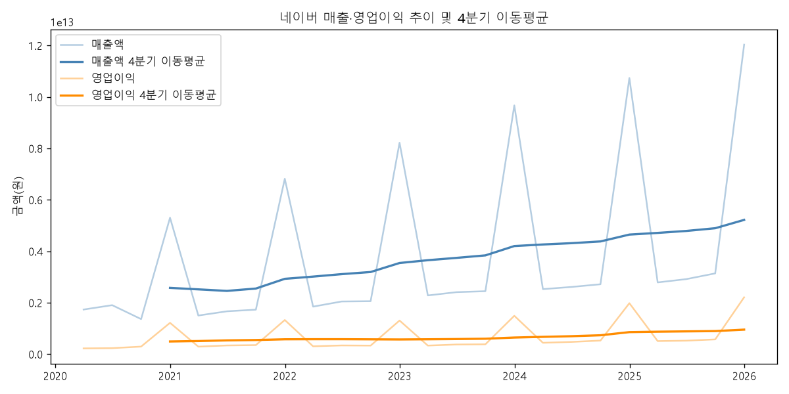
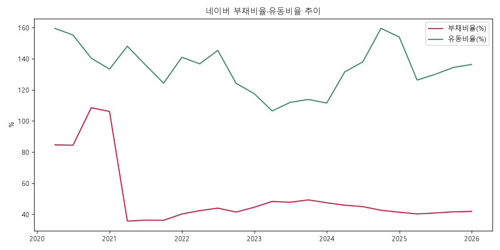
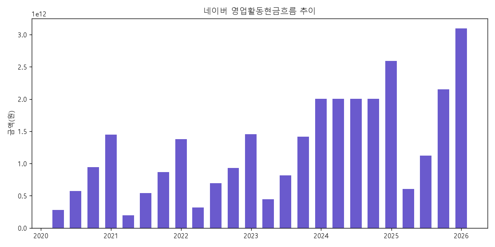
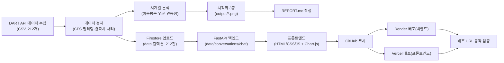
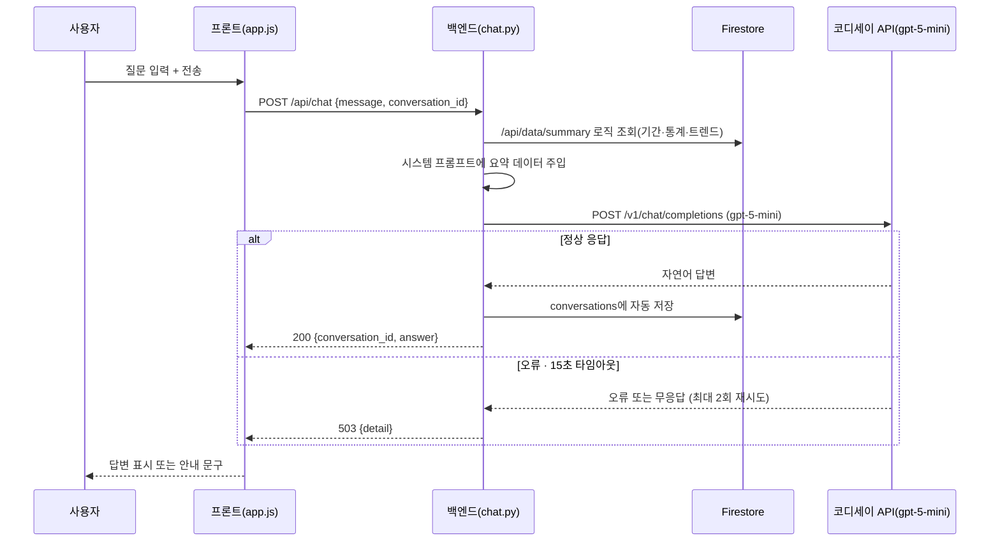

# 네이버 재무건전성 분석 AI 비서 💰

> 온라인 셀러가 네이버 스마트스토어 입점을 "감"이 아닌 데이터로 판단할 수 있도록,
> 네이버의 분기별 재무제표를 분석하고 AI 챗봇으로 질문에 답해주는 웹 서비스

**🔗 배포 URL (프론트):** https://m1-2-nine.vercel.app
**🔗 배포 URL (백엔드 API):** https://m1-2-xvcs.onrender.com/docs
**💻 GitHub:** https://github.com/ilililililil4319/M1-2
**📄 결과보고서:** [`docs/2_결과보고서_네이버_재무건전성_분석.md`](docs/2_결과보고서_네이버_재무건전성_분석.md)
**🛠 Render 대시보드(개발자 주소, 로그인 필요):** https://dashboard.render.com/web/srv-dah1i7bl550s73d6ajg0
**🛠 Vercel 대시보드(개발자 주소, 로그인 필요):** https://vercel.com/1-ac35/m1-2


---

## 목차

1. [프로젝트 소개](#1-프로젝트-소개)
2. [분석 질문 (3개 이상)](#2-분석-질문-3개-이상)
3. [프로젝트 개요 및 산출물 구성](#3-프로젝트-개요-및-산출물-구성)
4. [폴더 구조](#4-폴더-구조)
5. [기술 스택](#5-기술-스택)
6. [데이터 설명 및 출처](#6-데이터-설명-및-출처)
7. [분석 방법 및 인사이트 요약](#7-분석-방법-및-인사이트-요약)
8. [전체 작업 순서 (STEP 1-19)](#8-전체-작업-순서-step-1-19)
9. [작업 흐름도](#9-작업-흐름도)
10. [코디세이 API 연동 구조 (AI 챗봇)](#10-코디세이-api-연동-구조-ai-챗봇)
11. [4대 화면 기능](#11-4대-화면-기능)
12. [보너스 기능](#12-보너스-기능)
13. [로컬 실행 방법](#13-로컬-실행-방법)
14. [배포 방법 및 환경 변수](#14-배포-방법-및-환경-변수)
15. [배포 중 발생한 오류와 해결](#15-배포-중-발생한-오류와-해결)
16. [AI(Claude) 사용 로그 요약](#16-aiclaude-사용-로그-요약)
17. [기능요구사항 대비 결과](#17-기능요구사항-대비-결과)
18. [결론 및 한계점](#18-결론-및-한계점)
19. [보안 유의사항](#19-보안-유의사항)
20. [데이터 출처 및 라이선스 유의사항](#20-데이터-출처-및-라이선스-유의사항)
21. [기타](#21-기타)

---

## 1. 프로젝트 소개

2024년 위메프·티몬(티메프) 정산 지연 사태로, 수많은 온라인 셀러들이 판매대금을 제때 받지 못하는 일을 겪었습니다. 플랫폼이 재무적으로 무너지고 있다는 신호는 사실 정산 지연이 뉴스로 터지기 전부터 재무제표 곳곳에 있었지만, 셀러 입장에서는 그 신호를 미리 확인할 방법도 습관도 없었습니다.

이 프로젝트는 국내 대표 오픈마켓 플랫폼인 **네이버**를 대상으로, 금융감독원 Open DART API에서 최근 6년(24개 분기)의 재무제표를 수집·정제·분석하여 성장성·수익성·안정성·현금창출력 지표의 추세를 파악하고, 이를 바탕으로 사용자의 질문에 답하는 **AI 챗봇 웹 서비스**를 구현한 개인 프로젝트입니다 (AI Native Master 미션과제 M1-2).

- **분석 대상:** 네이버(NAVER, 종목코드 035420) 분기별 재무제표 9개 지표 (2020-2025년, 212개)
- **핵심 가치:** 감이 아닌 "실제 재무 데이터"로 플랫폼 입점을 판단하고, AI 챗봇으로 쉽게 질의응답
- **4대 기능:** 데이터 기반 AI 채팅 / 데이터 관리(CRUD) / 대화 기록 저장·불러오기 / 요약 정보 표시
- **보너스:** 다크모드 토글, CSV/JSON 내보내기, 추가 시각화(안정성 지표 추이), 변동성(표준편차) 지표 확장

---


## 2. 분석 질문 (3개 이상)

1. 네이버의 성장성·수익성·안정성 지표는 지난 6년간 어떤 추세를 보였는가?
2. 안정성 지표(부채비율·유동비율)에 급격한 변화가 있었던 분기가 있으며, 어떤 이슈와 연결되는가?
3. 위메프 사태처럼 "정산 지연" 리스크를 미리 포착할 수 있는 재무적 신호(현금흐름 급감, 유동비율 하락 등)가 나타난 적이 있는가?

---


## 3. 프로젝트 개요 및 산출물 구성

| 항목 | 내용 |
|---|---|
| 과제명 | AI Agent 개발: 나만의 AI 비서 구축 (미션과제 M1-2) |
| 분석 주제 | 온라인 셀러를 위한 네이버 재무건전성 분석 AI 비서 |
| 작성 형태 | 개인 프로젝트 (1인 수행) |
| 사용 AI 도구 | Claude(Anthropic, 분석/코드 생성·디버깅·배포 보조), 코디세이 API `gpt-5-mini`(AI 챗봇 응답) |
| 보너스 과제 | 다크모드 토글, CSV/JSON 내보내기, 추가 시각화(안정성 지표), 변동성 지표 확장 |

**산출물 구성**

| 산출물 | 형식 | 위치 |
|---|---|---|
| 웹 서비스(백엔드) | FastAPI, Render 배포 | `backend/`, https://m1-2-xvcs.onrender.com |
| 웹 서비스(프론트엔드) | HTML/CSS/JS, Vercel 배포 | `frontend/`, https://m1-2-nine.vercel.app |
| 분석 리포트 | REPORT.md | 루트 |
| 기획서 | PDF + md | `docs/` |
| 결과보고서 | PDF + md | `docs/` |
| 분석 코드 | Jupyter Notebook | `notebook/prepare_data.ipynb` |
| 시각화 | PNG 3종 | `output/` |
| 증빙 스크린샷 | PNG 다수 | `screenshots/` |

---


## 4. 폴더 구조

README와 결과보고서가 어디에 있는지 먼저 확인하세요.

```
M1-2/
├── README.md                          ← 지금 보고 있는 파일
├── REPORT.md                          # 분석 리포트 (최종 결과물, Fact-Why-Action 구조)
├── .gitignore
│
├── data/
│   ├── naver_financials_raw.csv       # DART 원본 (728행)
│   └── naver_financials.csv           # 정제된 long format (212개)
│
├── docs/                              # 기획서 · 결과보고서 (PDF + md)
│   ├── 1_기획서_네이버_재무건전성_분석.pdf
│   ├── 1_기획서_네이버_재무건전성_분석.md
│   ├── 2_결과보고서_네이버_재무건전성_분석.pdf  ← 결과보고서는 여기
│   └── 2_결과보고서_네이버_재무건전성_분석.md   ← 결과보고서는 여기
│
├── notebook/
│   └── prepare_data.ipynb             # 데이터 수집부터 시각화까지 전체 분석 코드
│
├── output/                            # 시각화 결과 (PNG 3종)
│   ├── 01_revenue_profit_trend.png
│   ├── 02_stability_ratios.png
│   └── 03_operating_cashflow.png
│
├── screenshots/                       # 작업 과정 증빙 스크린샷 (86장 이상)
│
├── backend/                            # FastAPI 백엔드 (Render 배포 루트)
│   ├── main.py                        # 앱 진입점, 라우터 등록
│   ├── requirements.txt
│   ├── .env                           # 로컬 API 키 (git 제외 대상)
│   └── app/
│       ├── core/firebase.py           # Firestore 클라이언트 초기화
│       ├── models/schemas.py          # Pydantic 스키마
│       ├── routers/
│       │   ├── data.py                # 데이터 CRUD 5종
│       │   ├── conversations.py       # 대화 기록 CRUD 5종
│       │   └── chat.py                # AI 챗봇 엔드포인트
│       └── services/
│           ├── data_service.py        # Firestore 데이터 로직 + 요약 통계
│           └── conversation_service.py
│
└── frontend/                           # 바닐라 HTML/CSS/JS (Vercel 배포 루트)
    ├── index.html                     # 4대 화면(채팅/데이터관리/대화기록/요약표시)
    ├── style.css                      # 디자인 토큰 + 다크모드
    └── app.js                         # API 연동 + Chart.js 시각화 + 내보내기
```

---


## 용어 설명 (초보자를 위한 참고)

| 용어 | 쉬운 설명 |
|---|---|
| 부채비율 | (총부채 ÷ 자기자본) × 100. 높을수록 자기자본 대비 빚 비중이 크다는 뜻 |
| 유동비율 | (유동자산 ÷ 유동부채) × 100. 100% 이상이면 1년 내 갚을 빚을 감당할 자산 여력이 있다는 뜻 |
| 자기자본비율 | (자기자본 ÷ 총자산) × 100. 전체 자산 중 빚이 아닌 순수 자기 돈의 비중 |
| 영업이익률 / 순이익률 | 매출액 대비 영업이익 / 순이익의 비율(%). 본업에서 얼마나 남기는지를 보여주는 수익성 지표 |
| 매출증가율(YoY) | Year-over-Year, 전년 같은 분기 대비 매출이 얼마나 늘었는지를 보는 증감률 |
| 연결재무제표(CFS) | 모회사와 자회사를 하나의 회사처럼 합산한 재무제표. 자회사가 연결범위에서 빠지면 수치가 크게 바뀔 수 있음 |
| 영업활동현금흐름 | 회사가 실제 영업으로 벌어들인 현금의 유출입. 장부상 이익과 달리 "실제 현금이 들어왔는지"를 보여줌 |
| 이동평균 | 최근 몇 개 구간의 평균을 계속 이동 계산해, 들쭉날쭉한 값을 완만한 추세선으로 보여주는 방법 |
| 변동성(표준편차) | 값이 평균에서 얼마나 흩어져 있는지를 나타내는 통계 지표. 클수록 등락이 심하다는 뜻 |
| CRUD | Create(생성)·Read(조회)·Update(수정)·Delete(삭제), 데이터 관리의 4가지 기본 동작 |
| API | 프로그램끼리 데이터를 주고받기 위한 정해진 규칙(창구) |
| Firestore | Google Firebase가 제공하는 클라우드 기반 NoSQL 데이터베이스 |
| CORS | 브라우저가 "다른 주소(도메인)의 서버로 보내는 요청"을 허용할지 검사하는 보안 정책 |
| Swagger UI | FastAPI가 자동으로 만들어주는, API를 브라우저에서 직접 테스트해볼 수 있는 화면(`/docs`) |
| 환경변수 | API 키처럼 코드에 직접 적지 않고, 서버 실행 환경에 별도로 저장해두는 설정값 |
| 코디세이 API | 이 프로젝트의 AI 챗봇 응답을 생성하는 데 사용한 API(`gpt-5-mini`, OpenAI와 동일 방식) |

---


## 5. 기술 스택

| 구분 | 내용 |
|---|---|
| 분석 환경 | Python 3.14, VS Code, Jupyter |
| 데이터 처리 | pandas, numpy, OpenDartReader |
| 시각화(분석) | matplotlib |
| 백엔드 | FastAPI, Pydantic, uvicorn |
| 데이터베이스 | Firebase Firestore |
| 프론트엔드 | HTML / CSS / JavaScript(바닐라), Chart.js(CDN) |
| AI 챗봇 API | 코디세이 API(`gpt-5-mini`, OpenAI 호환) |
| 배포 | Render(백엔드), Vercel(프론트엔드) |
| 버전관리 | Git / GitHub |
| 데이터 출처 | 금융감독원 전자공시시스템(DART) Open API |

---


## 6. 데이터 설명 및 출처

**목적:** 분석의 신뢰도는 원본 데이터의 정확성에서 출발한다. 공식 출처(DART)에서 데이터를 직접 수집하고, 어떤 기준으로 정제·보정했는지 투명하게 밝혀야 이후의 시각화·인사이트도 신뢰할 수 있다.

| 항목 | 내용 |
|---|---|
| 출처 | 금융감독원 Open DART API (OpenDartReader 라이브러리)<br/>https://opendart.fss.or.kr |
| 대상 기업 | 네이버(NAVER Corp, 종목코드 035420) — 연결재무제표(CFS) 기준 |
| 수집 기간 | 2020년 - 2025년 (24개 분기) |
| 원본 데이터 규모 | 728행 |
| 최종 데이터 규모 | 212개 (long format: date, value, memo) — 요구사항(100개 이상) 대비 2배 이상 |
| 분석 지표(9개) | 성장성: 매출액, 매출증가율(YoY) / 수익성: 영업이익, 영업이익률, 순이익률 /<br/>재무안정성: 부채비율, 유동비율, 자기자본비율 / 현금창출력: 영업활동현금흐름 |
| 원본 파일 | `data/naver_financials_raw.csv` |
| 정제 파일 | `data/naver_financials.csv` |

**DART에서 데이터를 수집한 과정**

| ① API 키 발급 | ② 재무제표 수집 | ③ 지표 추출·정제 |
|:---:|:---:|:---:|
|  |  |  |

1. Open DART(https://opendart.fss.or.kr) 접속 후 API 키 발급
2. `OpenDartReader`로 네이버(035420) 분기별 재무제표(재무상태표·손익계산서·현금흐름표) 수집
3. 연결재무제표(CFS) 필터링 → 9개 지표 계산 → long format(date, value, memo) 변환

**데이터 정제 결과**

| ① 결측치 처리 전 | ② 결측치 처리 후 |
|:---:|:---:|
|  |  |

- **결측치**: 영업활동현금흐름 2024년 1-3분기 결측(21개 → 24개) → **직전 분기값으로 대체(forward fill)**. 매출증가율(YoY)의 2020년 결측 4건은 비교할 전년 동기 데이터가 없는 자연스러운 결측이라 별도 보정 없이 제외.
- **이상치**: 레벨(금액) 값 자체에서는 통계적 이상치 없음. 다만 매출·영업이익은 분기 누적 공시 특성상 4분기마다 급증하는 패턴이 있는데, 이상치가 아니라 공시 구조에 따른 정상적 특성으로 확인(7장 인사이트 참고).

**정제 결과 요약**: 원본 728행 → 정제 후 212개(date, value, memo), 결측치 3건(영업활동현금흐름) 보정 완료, 이상치 미발견.

**왜 이 기준을 정했는가:** 결측치를 무조건 0이나 평균으로 채우면 실제로는 없던 급락·급등을 만들어낼 수 있다. 직전 분기값으로 대체하는 방식은 "데이터가 없다고 해서 실적이 0이 된 것은 아니다"라는 재무 데이터의 특성을 보존하기 위한 선택이다.

데이터 설명·정제 기준의 전체 근거는 [`REPORT.md`](./REPORT.md#3-데이터-설명)와 결과보고서에서 자세히 다룹니다.

---


## 7. 분석 방법 및 인사이트 요약

**적용한 시계열 기법 3가지**

| 기법 | 설명 | 선정 이유 |
|---|---|---|
| 4분기 이동평균(Moving Average) | 분기별 변동을 완만하게 하여 중장기 추세 확인 | 분기 누적 공시 특성상 4분기(연말)마다 급증하는 톱니 패턴이 있어, 원본 값만으로는 실제 추세 판단이 어렵기 때문 |
| 전년동기대비 증감률(YoY) | 매출증가율을 연간 비교 기준으로 계산 | 분기 매출은 계절성이 강해 직전 분기와 단순 비교하면 왜곡되므로, 1년 전 같은 분기와 비교하기 위해 |
| 변동성(Volatility) | 지표별 표준편차로 안정성·변동폭 비교 | 평균·추세만으로는 알 수 없는 "등락의 심한 정도"를 정량적으로 비교하기 위해 |

**시각화 3종**

| ① 매출·영업이익 추이 | ② 부채비율·유동비율 추이 | ③ 영업활동현금흐름 추이 |
|:---:|:---:|:---:|
|  |  |  |

**인사이트 (3개 이상, Fact–Why–Action 구조)**

1. **분기마다 반복되는 "톱니 패턴" — 매출·영업이익이 4분기(연말)마다 급증하는 것처럼 보임**
   - **관찰(Fact):** 2020-2025년 전 기간에 걸쳐, 매출액·영업이익 그래프가 매년 4분기(연간 사업보고서 시점)마다 직전 분기 대비 2-3배 가까이 급증하는 패턴이 24개 분기 내내 예외 없이 반복된다.
   - **해석(Why):** DART 분기보고서의 손익계산서 항목은 "해당 분기만의 실적"이 아니라 **사업연도 누적값**으로 공시된다. 이 공시 특성을 모르고 그래프만 보면 "4분기마다 실적이 폭발적으로 좋아진다"고 오해하기 쉽다.
   - **조치(Action):** 순수 분기 실적을 보려면 각 분기 누적값에서 직전 분기 누적값을 차감해 환산해서 봐야 한다.
2. **2021년 부채비율 급락(106.1% → 35.65%) — 재무구조 악화가 아니라 연결범위 변경**
   - **관찰(Fact):** 2021년 1분기 106.10%였던 부채비율이 2분기 35.65%로 한 분기 만에 70%포인트 급락했고, 이후 줄곧 40%대 안팎의 안정적인 수준을 유지하고 있다.
   - **해석(Why):** 이 시점은 라인(LINE)-야후재팬(Z홀딩스) 경영통합과 정확히 일치한다. 라인이 연결범위에서 제외(지분법 적용 전환)되며 부채 총액 자체가 줄어든 회계적 요인이다.
     > **출처:** [전자신문, "Z홀딩스-라인, 경영 통합 완료···2023년 매출 21조원 목표", 2021.03.01.](https://www.etnews.com/20210301000132) — 2021년 3월 1일 경영통합 완료 시점이 본 리포트가 관찰한 부채비율 급락(1분기→2분기) 시점과 일치함을 확인했다.
   - **조치(Action):** 재무비율에 급격한 변화가 관찰되면, 곧바로 "좋아졌다/나빠졌다"로 단정하지 말고 지분 매각·합병·자회사 편입 같은 지배구조 변경 이슈부터 확인해야 한다.
3. **2024년 이후 영업활동현금흐름 뚜렷한 증가 추세**
   - **관찰(Fact):** 분기별 영업활동현금흐름이 2020-2023년 3천억-1.5조 원 사이에서 등락했으나, 2024년부터는 대부분 2조 원을 넘어섰고 분석 기간 중 최고치를 기록했다.
   - **해석(Why):** 같은 기간 매출액의 4분기 이동평균도 꾸준히 우상향하고 있어, 매출 성장과 함께 실제 현금창출력도 구조적으로 개선되고 있는 것으로 보인다.
   - **조치(Action):** 정산 여력과 직결되는 지표이므로, 최근 추세가 향후 분기에도 유지되는지 정기적으로 모니터링할 것을 권고한다.

> 위 조치(Action)는 일반적인 리스크 모니터링 관점의 참고이며, 특정 입점 시점을 지시하는 투자·경영 조언이 아닙니다. 자세한 근거는 [`REPORT.md`](./REPORT.md#6-인사이트-3개-이상-factwhyaction-구조)를 참고하세요.

---


## 8. 전체 작업 순서 (STEP 1-19)

| STEP | 작업 내용 | 증빙 |
|:---:|---|:---:|
| 1 | 기획서 작성 | `docs/1_기획서` |
| 2 | 폴더 구조 초기화 + GitHub 저장소 + `.gitignore` 설정 | — |
| 3 | Open DART API 키 발급 + 데이터 수집(OpenDartReader) | 01, 07-09 |
| 4 | 데이터 정제(CFS 필터링, long format 변환, 결측치 처리) | 10-24 |
| 5 | 시계열 분석(4분기 이동평균·YoY·변동성) | 27 |
| 6 | 시각화 3종 제작 | 28-30 |
| 7 | 인사이트 도출 및 REPORT.md 작성 | — |
| 8 | Firebase 프로젝트·Firestore 생성, 서비스 계정 키 발급 | 32-39 |
| 9 | FastAPI 데이터 API 5종 개발(CRUD 4 + summary) | 40-48 |
| 10 | 대화 기록 API 개발(저장/조회/삭제) | 49-55 |
| 11 | AI 챗봇 API 개발(요약 조회 → 프롬프트 주입 → 코디세이 호출 → 자동 저장) | 56-63 |
| 12 | 프론트엔드 개발(채팅/데이터관리/대화기록/요약 4대 화면) | 64-67 |
| 13 | 보너스: 다크모드 · CSV/JSON 내보내기 · 추가 시각화 · 변동성 지표 | (보너스 스크린샷) |
| 14 | 로컬 통합 테스트 | 67 |
| 15 | 백엔드 Render 배포 + 환경변수 설정 | 68-71 |
| 16 | 프론트엔드 Vercel 배포 + `API_BASE_URL` 설정 | 74-76 |
| 17 | 배포 URL 최종 동작 검증(Swagger UI 포함) | 72-86 |
| 18 | README.md 작성 | 본 문서 |
| 19 | 최종 제출 패키지 정리 | — |

---


## 9. 작업 흐름도

**목적:** 이 프로젝트는 "데이터 분석"과 "웹 서비스 개발"이라는 두 흐름이 중간에 Firestore를 매개로 합쳐지는 구조다. 텍스트 설명만으로는 어디서 두 흐름이 만나고 어떻게 배포까지 이어지는지 한눈에 파악하기 어려워, 전체 파이프라인과 챗봇 요청 처리 과정을 각각 다이어그램으로 정리했다.

### 10-1. 전체 서비스 파이프라인

**설명:** DART에서 데이터를 수집·정제하는 왼쪽 흐름(A→E)과, 그 데이터를 Firestore에 올려 웹 서비스로 만드는 오른쪽 흐름(F→L)이 "B(데이터 정제)"에서 갈라진다. 분석 리포트(REPORT.md)와 실제 배포된 웹 서비스는 같은 정제 데이터를 공유하는 두 가지 산출물이라는 점을 보여준다.



### 10-2. AI 챗봇 요청 시퀀스

**설명:** 사용자가 질문을 보냈을 때 백엔드 내부에서 일어나는 일을 시간 순서로 보여준다. 핵심은 코디세이 API를 호출하기 "전에" 항상 `/api/data/summary`를 먼저 조회해 최신 데이터 요약을 프롬프트에 넣는다는 것과, 실패 시 재시도 후 503으로 명확히 실패를 알린다는 것이다(자세한 이유는 10장 "설계 노트" 참고).



---


## 10. 코디세이 API 연동 구조 (AI 챗봇)

코디세이 API(`gpt-5-mini`, OpenAI 호환)는 백엔드 `backend/app/routers/chat.py`에서 호출합니다.

```python
client = OpenAI(
    api_key=os.getenv("CODYSSEY_API_KEY"),
    base_url="https://copa.codyssey.kr/v1",
    http_client=httpx.Client(trust_env=False),  # Windows 환경변수發 encoding 오류 방지
)
```

**워크플로우**

1. 사용자가 질문을 입력하면 `POST /api/chat`으로 전송
2. `data_service.get_summary()`를 재사용해 기간·데이터 개수·트렌드·지표별 통계(+변동성)를 조회
3. 조회한 요약을 시스템 프롬프트에 삽입
4. 코디세이 API(`gpt-5-mini`) 호출 (`max_tokens=2000`, `timeout=15초`, 최대 2회 재시도)
5. 응답을 `conversations` 컬렉션에 자동 저장(질문+답변 메시지 쌍)
6. `{conversation_id, answer}` 형태로 프론트에 반환

**오류 처리**

| 상황 | 처리 |
|---|---|
| 코디세이 API 응답 실패(인증오류·rate limit 등) | 최대 2회 재시도 |
| 15초 초과 | 타임아웃, 재시도 후 최종 503 응답 |
| 재시도 모두 실패 | 503 + 안내 메시지, 프론트에서 오류 문구 표시 |
| 대화 저장 실패(잘못된 conversation_id) | 404 응답 |


### 설계 노트

**Firestore 컬렉션을 `data`·`conversations` 2개로 분리한 이유**
재무 데이터(`data`)와 대화 기록(`conversations`)은 조회 패턴이 서로 다르다. `data`는 날짜순 정렬·집계(요약 통계) 위주로 조회되고, `conversations`는 문서 단위(대화 하나)로 통째로 읽고 그 안의 `messages` 배열을 함께 반환하는 구조다. 두 데이터를 한 컬렉션에 섞으면 요약 집계 쿼리에 대화 메시지까지 스캔 대상에 포함되어 비효율적이므로, 조회 단위가 다른 두 데이터를 처음부터 컬렉션 단위로 분리했다.

**시스템 프롬프트에 요약(`summary`)을 주입하는 방식의 장단점**
- 장점: 질문마다 212개 데이터 전체를 프롬프트에 넣지 않고 기간·통계·트렌드만 요약해서 넣으므로, 토큰 비용이 줄고 응답 속도가 빨라진다. 또한 AI가 원본 데이터를 임의로 왜곡 해석할 여지가 줄어든다.
- 단점: 요약값(평균·최대·최소 등)만 전달되므로, 사용자가 "3번째 분기 값이 정확히 얼마야?" 같은 세부 질의를 하면 정확히 답하지 못할 수 있다. 또한 요약 로직 자체에 오류가 있으면 챗봇 답변도 함께 틀리게 된다(단일 실패 지점).

**콜드스타트(Cold Start) 안내**
Render 무료 플랜은 일정 시간 요청이 없으면 서버가 슬립 모드로 전환되며, 슬립 이후 첫 요청은 서버가 다시 깨어나는 데 최대 50초 정도 걸릴 수 있다(배포 화면에도 "Your free instance will spin down with inactivity" 안내가 표시됨). 별도의 프리워밍 없이 무료 플랜을 그대로 사용했으므로, 평가 시 처음 접속했을 때 응답이 느리다면 콜드스타트 때문일 가능성이 높다 — 몇 초 기다린 후 새로고침하면 정상 속도로 동작한다.

**입력값 위험 대응**
`ChatRequest.message`, `DataItem.memo`, `ConversationCreate.title`, `Message.content` 등 모든 사용자 입력 필드에 Pydantic `Field(max_length=...)` 제약을 적용했다(예: 채팅 메시지 최대 2000자, 메모 최대 100자, 대화 제목 최대 200자). 또한 `field_validator`로 제어 문자(널바이트 등)를 제거하고 앞뒤 공백을 정리하는 기본 정제(sanitization)를 서버 측에서도 적용해, 프론트엔드의 `textContent` 렌더링(XSS 방어)에 더해 이중으로 방어한다. 공백만 있는 입력이나 규격에 안 맞는 값(예: 날짜 형식 오류)은 요청 단계에서 422 오류로 거부된다.

**실제 테스트 증빙**

| 테스트 | 입력 | 결과 |
|---|---|---|
| 메시지 길이 제한 | 2000자 초과 메시지 전송 | `422`, `"max_length": 2000` |
| 날짜 형식 검증 | `"2026/06/30"` (슬래시) 전송 | `422`, `pattern '^\d{4}-\d{2}-\d{2}$'` 불일치 |
| 공백만 있는 입력 거부 | `"message": "   "` 전송 | `422`, `"message는 공백만으로 구성될 수 없습니다."` |

| 길이 제한 테스트 요청 | 길이 제한 422 응답 |
|:---:|:---:|
|  |  |

| 날짜 형식 테스트 요청 | 날짜 형식 422 응답 |
|:---:|:---:|
|  |  |

| 공백 입력 테스트 요청 | 공백 입력 422 응답 |
|:---:|:---:|
|  |  |

세 가지 검증 모두 코드 수정 직후 Swagger UI에서 직접 실행해 실제로 422 오류가 발생하는 것을 확인했다.

---


## 11. 4대 화면 기능

**목적:** 백엔드 API가 동작해도, 실제 사용자가 마주하는 화면에서 문제없이 연동되는지는 별도로 확인해야 한다. 채팅·데이터관리·대화기록·요약표시 4개 화면 각각을 직접 조작하며 동작을 검증했다.

| 화면 | 기능 | 관련 엔드포인트 |
|---|---|---|
| 채팅 | 질문 입력 → AI 답변, 대화 이어가기(`conversation_id` 유지), 로딩 표시 | `POST /api/chat` |
| 데이터 관리 | 데이터 추가/목록 조회/삭제(CRUD) | `GET/POST/PUT/DELETE /api/data` |
| 대화 기록 | 대화 목록 조회 → 클릭 시 상세 메시지 표시 | `GET /api/conversations`, `GET /api/conversations/{id}` |
| 요약 표시 | 지표별 통계 테이블 + 매출액 추이 차트 | `GET /api/data/summary` |

| 채팅 | 데이터 관리 |
|:---:|:---:|
|  |  |

| 대화 기록 | 요약 표시 |
|:---:|:---:|
|  |  |

왼쪽 위부터 시계방향: 질문을 입력하면 AI가 데이터 기반으로 답하는 채팅 화면, 212개 데이터를 추가·삭제할 수 있는 데이터 관리 화면, 지난 대화를 다시 불러오는 대화 기록 화면, 지표별 통계와 차트를 보여주는 요약 표시 화면이다.

---


## 12. 보너스 기능

**목적:** 필수 4대 화면 외에, 사용성을 높이는 추가 기능(다크모드·내보내기)과 분석 깊이를 더하는 추가 지표(안정성 지표 추이·변동성)를 구현해 제출물의 완성도를 높였다.

기본 4대 화면 위에 아래 4가지를 추가로 구현했습니다.

| 기능 | 구현 내용 |
|---|---|
| 다크모드 토글 | 헤더 우측 🌙/☀️ 버튼, `localStorage`로 선택 기억 |
| CSV/JSON 내보내기 | 데이터 관리 화면에서 전체 데이터를 파일로 다운로드 |
| 추가 시각화 | 요약 표시 화면에 "안정성 지표 추이"(부채비율·유동비율) 차트 신규 추가 |
| 변동성(표준편차) 지표 | 백엔드 `/api/data/summary`에 지표별 표준편차 계산 추가, 요약 테이블에 컬럼 반영 |

**보너스 기능 동작 확인**

| 다크모드 토글 | CSV/JSON 내보내기 |
|:---:|:---:|
|  |  |

왼쪽: 헤더의 🌙 버튼을 눌러 전체 화면이 다크 톤으로 전환된 모습(`localStorage`로 선택값 기억). 오른쪽: 데이터 관리 화면에서 "CSV 내보내기"·"JSON 내보내기" 버튼으로 데이터를 파일로 다운로드하는 모습이다.

**추가 시각화(안정성 지표 추이) + 변동성(표준편차) 지표**


---


## 13. 로컬 실행 방법

### 백엔드 실행

```bash
cd backend
python -m venv .venv
.venv\Scripts\activate      # Windows 기준
pip install -r requirements.txt

# backend/.env 파일에 아래 4개 값 설정
# CODYSSEY_API_KEY=...
# DART_API_KEY=...
# ALLOWED_ORIGINS=http://localhost:5500,http://127.0.0.1:5500
# FIREBASE_SERVICE_ACCOUNT_JSON=...

uvicorn main:app --reload
```

`http://127.0.0.1:8000/docs`에서 Swagger UI로 API 테스트 가능합니다.

### 프론트엔드 로컬 미리보기

`frontend/index.html`을 더블클릭으로 열면 `fetch` 요청이 CORS 정책에 막힙니다. 반드시 로컬 서버로 열어야 합니다.

- **VS Code Live Server 확장** 설치 → `frontend/index.html` 우클릭 → "Open with Live Server"

로컬 미리보기 시 `frontend/app.js`의 `API_BASE_URL`을 `http://127.0.0.1:8000`으로 바꿔야 로컬 백엔드와 연동됩니다(배포본은 Render 주소로 고정되어 있음).

---


## 14. 배포 방법 및 환경 변수

### 백엔드 — Render

1. GitHub 저장소를 Render와 연동(New Web Service)
2. **Root Directory를 `backend`로 지정**
3. Build Command: `pip install -r requirements.txt`
4. Start Command: `uvicorn main:app --host 0.0.0.0 --port $PORT`
5. Environment Variables에 아래 4개 추가 후 Deploy

| 변수명 | 설명 |
|---|---|
| `CODYSSEY_API_KEY` | 코디세이 API 인증 키 |
| `DART_API_KEY` | Open DART API 키 |
| `ALLOWED_ORIGINS` | 프론트엔드 배포 주소 포함 (CORS 허용 목록) |
| `FIREBASE_SERVICE_ACCOUNT_JSON` | Firebase 서비스 계정 키(JSON 문자열) |

### 프론트엔드 — Vercel

1. GitHub 저장소를 Vercel과 연동(Import Project)
2. **Root Directory를 `frontend`로 지정**
3. Framework Preset: **Other** (빌드 과정 없는 바닐라 프로젝트)
4. Deploy

배포 후 Render의 `ALLOWED_ORIGINS`에 실제 Vercel 주소를 추가하고 재배포해야 CORS 오류 없이 정상 연동됩니다.

| Render 배포 성공 | Vercel 배포 성공 |
|:---:|:---:|
|  |  |

*왼쪽: Render 대시보드의 배포 이력. 모든 배포가 초록색 체크(성공)로 표시되어 있으며, 가장 최근 배포("입력값 검증 실제 테스트 증빙 추가")까지 정상 반영됐다. 오른쪽: Vercel 대시보드의 배포(Deployments) 목록. 전부 "Ready" 상태로 최신 커밋까지 문제없이 배포됐다.*

---


## 15. 배포 중 발생한 오류와 해결

| 오류 | 원인 | 해결 | 증빙 |
|---|---|---|:---:|
| GitHub push 거부<br/>(secret scanning) | 재발급 전 옛 서비스 계정<br/>키 파일이 커밋 이력에 포함 | 이미 폐기된 키임을 확인 후<br/>unblock 처리, 해당 파일 삭제 | — |
| 코디세이 API 호출 시<br/>`'ascii' codec can't encode` | Windows 환경변수를 httpx가<br/>자동으로 읽다가 인코딩 실패 | `httpx.Client(trust_env=False)`로<br/>환경변수 자동 읽기 차단 | 61 |
| 챗봇 응답이<br/>빈 문자열(`""`) | `max_tokens=800`이 너무 낮아<br/>추론 모델이 답변 전에 토큰 소진 | `max_tokens=2000`으로 상향 | 61-6 |
| Render 빌드 실패<br/>(`requirements.txt` 못 찾음) | Root Directory 미지정 +<br/>`requirements.txt` 파일 자체가<br/>커밋된 적 없었음 | Root Directory를 `backend`로<br/>지정, `requirements.txt` 신규 생성 후 push | 70 |
| 프론트 배포 후<br/>"Failed to fetch" | `file://`로 직접 열어<br/>CORS 정책에 막힘 | Live Server(`http://`)로 실행 | 65-66 |
| 배포 사이트에서도<br/>"Failed to fetch" | Render `ALLOWED_ORIGINS`에<br/>실제 Vercel 주소 미포함 | 환경변수에 Vercel 주소 추가 후<br/>재배포 | 79 |

**오류 처리 과정 증빙**

*아래 3장 중 왼쪽 2장은 실제 "오류가 발생한 화면"이고, 오른쪽 1장은 원인을 고친 "이후의 정상 응답 화면"이다 — 문제가 어떻게 해결됐는지 전후를 비교할 수 있도록 함께 실었다.*

| ① 코디세이 API 오류 발생(503) | ② 원인 추적(서버 콘솔 traceback 디버깅) | ③ 해결 후 정상 응답(200, 참고용) |
|:---:|:---:|:---:|
|  |  |  |

*① 실제 503 오류가 발생한 화면. ② 서버 콘솔에 traceback을 직접 출력시켜 원인(인코딩 오류)을 추적하는 화면. ③ 원인 해결 후 정상적으로 재무 데이터 기반 답변이 돌아온 화면 — 이 장만 유일하게 성공 화면이며, 문제 해결을 증명하기 위해 의도적으로 넣었다.*

| ④ Render 빌드 실패 로그(원인) | ⑤ 이후 배포 이력(해결 후 정상 반영, 참고용) |
|:---:|:---:|
|  |  |

*④ requirements.txt를 찾지 못해 빌드가 실패한 실제 로그 화면. ⑤ Root Directory 수정 후 이어진 배포들이 전부 성공(초록 체크)으로 기록된 Render 배포 이력 — 역시 해결을 증명하기 위한 참고용 성공 화면이다.*

---


## 16. AI(Claude) 사용 로그 요약

| 사용 작업 | 사용 이유 | 검증 방법 |
|---|---|---|
| FastAPI 라우터/서비스 코드 작성<br/>(data, conversations, chat) | CRUD·AI 연동<br/>보일러플레이트 작성 시간 절감 | Swagger UI에서<br/>직접 Execute하여 응답 확인 |
| 프론트엔드 4대 화면<br/>(HTML/CSS/JS) 구현 | 바닐라 JS 컴포넌트를<br/>빠르게 구현 | 브라우저에서 실제 클릭·입력하며<br/>동작 여부 직접 확인 |
| 배포 오류(Render 빌드 실패,<br/>CORS, 인코딩 오류) 디버깅 | 에러 메시지 원인 분석 및<br/>수정 방향 제시 | 배포 로그·Swagger 응답 코드로<br/>재현 및 재확인 |
| 부채비율 급락 원인<br/>(라인-야후재팬 통합) 검증 | 특정 분기에 어떤 사건이<br/>있었는지 조사 | AI가 웹 검색으로 사실관계<br/>(경영통합 시점) 확인 후 반영 |

> AI가 제시한 코드·가설을 그대로 채택하지 않고, Swagger 응답·브라우저 동작·웹 검색 결과로 직접 재검증한 뒤에만 최종 결과물에 반영한다는 원칙을 지켰습니다.

---


## 17. 기능요구사항 대비 결과

| 요구사항 | 구현 위치 | 달성 |
|---|---|:---:|
| 데이터 100개 이상<br/>+ 출처/기간 명시 | `data/naver_financials.csv`<br/>(212개, DART) | ✅ |
| 분석 질문 3개 이상 | `REPORT.md` 2장 | ✅ |
| 결측치/이상치<br/>확인 및 처리 | `REPORT.md` 3장 | ✅ |
| 시계열 기법 2개 이상 적용 | 이동평균·YoY·변동성(3개) | ✅ |
| 시각화 2개 이상 | `output/*.png`(3개) | ✅ |
| 인사이트 3개 이상<br/>(Fact-Why-Action 구조) | `REPORT.md` 6장 | ✅ |
| 데이터 기반 AI 채팅 | `POST /api/chat` + 채팅 화면 | ✅ |
| 데이터 관리 CRUD | `/api/data` + 데이터관리 화면 | ✅ |
| 대화 기록 저장·불러오기 | `/api/conversations` + 대화기록 화면 | ✅ |
| 배포 및 문서화 | Render+Vercel, Swagger `/docs`, 본 README | ✅ |
| API 키 미노출 | `.env` + `.gitignore` + 플랫폼 환경변수 | ✅ |
| 보너스(다크모드·내보내기·<br/>추가시각화·변동성지표) | `frontend/`, `data_service.py` | ✅ |

### AI 사전평가 결과

제출 전 AI 사전평가를 여러 차례 실행하며 지적 사항을 보완했다. 1차 78%(14/18) → 2차 94%(17/18, 서버 측 입력값 검증 코드 추가로 유일한 미통과 항목 해결) → **최종 100%(18/18) 전 항목 통과**로 마무리했다. 자세한 회차별 보완 내역은 결과보고서 Ⅳ장 "AI 사전평가 결과 반영"에 정리되어 있다.


*최종(6차) AI 사전평가 결과 — 18개 항목 전체 통과(100%). 배포 URL·Swagger·Firestore 연동·요약 API 주입·대화 저장·프론트 연동·환경변수·콜드스타트 안내 등 미션 핵심을 문서와 코드·스크린샷으로 충실히 증빙하고 있다는 평가다.*

---


## 18. 결론 및 한계점

### 결론

- 분석 기간(2020-2025) 동안 네이버의 매출·영업이익은 꾸준한 우상향 추세를 보였습니다.
- 부채비율은 2021년 상반기를 기점으로 구조적으로 낮아진 뒤 안정적으로 유지되고 있으며, 이는 재무구조 악화가 아니라 연결범위 변경에 따른 변화였습니다.
- 영업활동현금흐름은 2024년 이후 뚜렷하게 확대되어, 온라인 셀러 입장에서 "정산금을 지급할 여력"과 직결되는 긍정적 신호로 해석됩니다.
- 종합적으로, 분석 기간 동안 네이버에서는 위메프 사태처럼 정산 리스크로 이어질 만한 재무적 경고 신호는 관찰되지 않았습니다.

### 한계점

- 부채비율 급락과 실제 사건(라인-야후재팬 통합)의 연결은 시기적 일치를 근거로 한 해석이며, 통계적 인과관계 검증은 아닙니다.
- 데이터가 분기 단위 스냅샷이라 분기 사이 발생·해소된 단기 이슈는 반영되지 않습니다.
- 영업활동현금흐름 2024년 1-3분기는 직전 분기값 대체 근사치입니다.
- 본 분석은 일반적인 재무 데이터 해석이며, 특정 시점의 입점 여부를 지시하는 투자·경영 조언이 아닙니다.

### 참고: 왜 전사(全社) 재무제표로 분석해도 되는가

이 프로젝트를 기획하는 단계에서부터 "네이버 법인 전체 재무제표만 있고, 스마트스토어(커머스 부문)만 분리된 재무제표는 없다"는 점이 계속 마음에 걸렸다. 그래서 애초에는 이 문서의 한계점으로 정리하고 시작했다. 그런데 실제로 과제를 진행하면서 "만약 스마트스토어에서 대규모 미정산 사태가 벌어지면, 같은 법인 안에서 현금흐름이 연동되어 회사 전체에 영향을 주는가?"가 궁금해져 직접 조사해봤고, 그 결과 이 문제는 한계점이 아니라 오히려 **전사 재무제표로 분석해도 되는 근거**라는 결론에 도달해 한계점 목록에서 제외했다.

- **동일 법인 내 현금 통합관리(Cash Pooling):** 스마트스토어·검색·콘텐츠 등 사업부문별 입금은 사업부 내부 회계상으로는 매출·영업이익을 구분할 수 있지만, 법률적·재무적 실체로서의 "현금"은 네이버(주)라는 단일 법인의 통합 계좌(또는 결제 자회사인 네이버파이낸셜 계좌)로 모여 하나로 관리된다. 즉 사업부문이 나뉘어 있어도 현금흐름은 분리되지 않는다.
- **리스크 전이(Cross-Risk):** 커머스 부문에서 대규모 미정산 사태가 발생해 현금이 대량으로 묶이면, 이는 네이버 전체의 현금성 자산을 즉시 차감시킨다. 부족분은 검색·웹툰·클라우드 등 다른 사업부문이 벌어들인 영업활동현금흐름으로 메워야 한다.
- **실제 사례로 뒷받침되는 리스크:** 이 구조는 가정이 아니라 위메프·티몬(티메프) 사태에서 실제로 드러난 문제와 일치한다. 모회사 큐텐이 인수 후 재무 기능을 본사로 흡수통합하면서, 판매대금 정산에 써야 할 자금이 다른 용도(인수자금·판촉비 등)로 유용된 것이 사태의 핵심 원인으로 지목된다.
- **제도적 대응:** 이런 구조적 위험을 막기 위해 2025년 7월 국회는 전자금융거래법 개정안(이른바 "티메프 방지법")을 통과시켜, PG업자가 보유한 정산 예정 금액의 100%를 외부 금융기관에 예치·신탁하도록 의무화했다. 공정거래위원회도 대규모유통업법 개정을 통해 매출 100억 원 이상 온라인 중개 플랫폼에 정산기한 준수·판매대금 별도관리 의무를 부과하는 방안을 추진하고 있다.

**출처**
- 법률신문(화우), "'PG업 정산 자금 보호조치 및 PG업 범위 합리화' 등 전자금융거래법 개정안, 정무위 통과", 2025.08.05. https://www.lawtimes.co.kr/news/articleView.html?idxno=210258
- 정책브리핑(공정거래위원회), "매출액 100억 원 이상 온라인 중개 플랫폼, '대규모유통업법' 적용", 2024.10.18. https://www.korea.kr/news/policyNewsView.do?newsId=148935237
- 나무위키, "큐텐 정산 지연 사태" — 재무기능 본사 흡수통합 및 정산금 유용 정황 정리. https://namu.wiki/w/%ED%81%90%ED%85%90%20%EC%A0%95%EC%82%B0%20%EC%A7%80%EC%97%B0%20%EC%82%AC%ED%83%9C

따라서 이 프로젝트가 스마트스토어만의 재무 건전성이 아니라 네이버 법인 전체의 재무제표를 분석 대상으로 삼은 것은 데이터 한계 때문에 어쩔 수 없이 택한 차선책이 아니라, 오히려 "같은 법인 안에서는 어차피 현금이 하나로 묶여 돈다"는 재무 구조상 더 타당한 선택이었다.

---


## 19. 보안 유의사항

- **API 키 관리:** 코디세이 API 키·DART API 키·Firebase 서비스 계정 키는 코드에 직접 작성하지 않고, 로컬은 `.env`, 배포 환경은 Render/Vercel Environment Variables로만 관리합니다.
- **`.gitignore` 등록:** `.env`, `serviceAccountKey.json`, `*.bak`은 `.gitignore`에 등록되어 GitHub 이력에 노출되지 않습니다. 커밋 전 항상 `git status`로 확인합니다.
- **키 유출 대응 원칙("폐기 확인이 먼저"):** 작업 중 GitHub Push Protection에 의해 과거(재발급 전) 서비스 계정 키가 커밋 이력에서 감지된 적이 있습니다. Google Cloud가 해당 키를 자동으로 사용 중지시킨 것을 확인했고, 현재 사용 중인(재발급된) 키와는 별개임을 검증한 뒤 안전하게 처리했습니다.
- **공용 PC 작업 시:** GitHub/Render/Vercel 로그인 정보를 브라우저에 저장하지 않고, 작업 종료 시 로그아웃 및 로컬 서버 종료를 확인합니다.

---


## 20. 데이터 출처 및 라이선스 유의사항

- 데이터 출처: [금융감독원 Open DART](https://opendart.fss.or.kr) — 네이버(NAVER Corp, 035420) 연결재무제표
- 본 프로젝트는 학습 목적의 분석이며, **투자·경영 조언이 아닙니다.**
- AI 챗봇 역시 제공된 재무 데이터에 근거한 사실만 서술하도록 시스템 프롬프트에서 확정적 조언을 명시적으로 금지하고 있습니다(10장 참고).

**GitHub 업로드 확인**


코드·데이터·문서·스크린샷 전체를 GitHub 저장소(https://github.com/ilililililil4319/M1-2)에 업로드 완료한 화면이다.

---


## 21. 기타

- 구현 과정에서 발생한 오류와 해결 과정은 15장과 `REPORT.md`에 함께 기록했습니다.
- AI(Claude)는 코드 작성·디버깅·배포 트러블슈팅·인사이트 사실관계 검증(웹 검색)에 활용했으며, 최종 해석·결론 문장은 직접 작성했습니다.
- 향후 개선 방향(사업부문별 세부 데이터 반영, 다른 플랫폼과의 비교 기능, 알림 기능 등)은 `REPORT.md` 마지막 장에 정리되어 있습니다.
- 본 문서는 `REPORT.md`·결과보고서와 함께 지속적으로 갱신되며, 세 문서 중 한쪽에서 보완된 내용(용어 설명, 출처, 설계 노트, 스크린샷 등)은 서로 반영해 동기화하고 있습니다.

---

*본 프로젝트는 M1-2 미션(AI Agent 개발: 나만의 AI 비서 구축)의 결과물로 작성되었습니다.*
