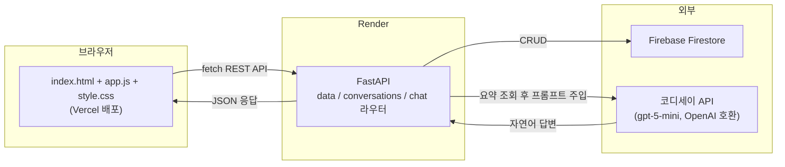
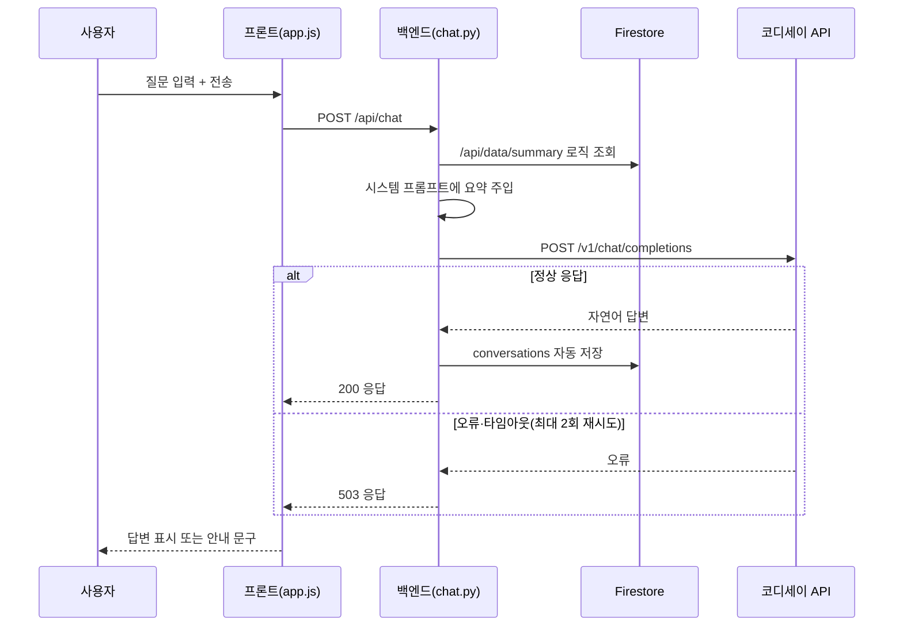

# 온라인 셀러를 위한 네이버 재무건전성 분석 — 결과보고서

| 항목 | 내용 |
|---|---|
| 과제명 | AI Agent 개발: 나만의 AI 비서 구축 (미션과제 M1-2) |
| 분석 주제 | 온라인 셀러를 위한 네이버 재무건전성 분석 AI 비서 |
| 작성 형태 | 개인 프로젝트 (1인 수행) |
| 배포 URL | https://m1-2-nine.vercel.app (프론트) / https://m1-2-xvcs.onrender.com (백엔드) |
| GitHub 저장소 | github.com/ilililililil4319/M1-2 |
| Render 대시보드(개발자 계정) | https://dashboard.render.com/web/srv-dah1i7bl550s73d6ajg0 |
| Vercel 대시보드(개발자 계정) | https://vercel.com/1-ac35/m1-2 |

## 목차
Ⅰ. 프로젝트 개요
Ⅱ. 분석 질문 (3개 이상)
Ⅲ. 폴더 구조
Ⅳ. 요구사항 대비 최종 구현 결과
Ⅴ. 시스템 구조 및 코디세이 API 연동
Ⅵ. 실행 결과 및 증빙 화면
Ⅶ. 오류 처리 이력 정리
Ⅷ. 자체 점검 체크리스트
Ⅸ. 결론 및 한계점
Ⅹ. 결과 도출 방법 및 최종 제출물
Ⅺ. 기타 — 소감 및 향후 개선 방향

---

## Ⅰ. 프로젝트 개요

### 용어 정리 (본 문서를 읽기 전에)

이 보고서는 재무 분석 용어와 개발 관련 용어가 함께 등장한다. 처음 읽는 분들을 위해 자주 나오는 용어를 먼저 정리한다.

**재무 용어**

| 용어 | 설명 |
|---|---|
| DART(다트) | 금융감독원 전자공시시스템. 상장기업의 재무제표·공시자료를 무료로 제공하는 공식 사이트 |
| 연결재무제표(CFS) | 모회사와 자회사를 하나의 회사처럼 합산한 재무제표. 반대말은 별도재무제표(OFS, 모회사 단독 기준) |
| 부채비율 | (총부채 ÷ 자기자본) × 100. 높을수록 자기자본 대비 빚 비중이 크다는 뜻 |
| 유동비율 | (유동자산 ÷ 유동부채) × 100. 100% 이상이면 1년 내 갚아야 할 빚을 갚을 자산 여력이 있다는 뜻 |
| 자기자본비율 | (자기자본 ÷ 총자산) × 100. 전체 자산 중 빚이 아닌 순수 자기 돈의 비중 |
| 영업이익률 / 순이익률 | 매출액 대비 영업이익 / 순이익의 비율(%). 본업에서 얼마나 남기는지를 보여주는 수익성 지표 |
| 매출증가율(YoY) | Year-over-Year, 전년 같은 분기 대비 매출이 얼마나 늘었는지를 보는 증감률 |
| 영업활동현금흐름 | 회사가 실제 영업으로 벌어들인 현금의 유출입. 장부상 이익과 달리 "실제 현금이 들어왔는지"를 보여준다 |
| 변동성(표준편차) | 값이 평균에서 얼마나 흩어져 있는지를 나타내는 통계 지표. 클수록 등락이 심하다는 뜻 |

**개발·서비스 용어**

| 용어 | 설명 |
|---|---|
| API | 프로그램끼리 데이터를 주고받기 위한 정해진 규칙(창구). REST API는 웹에서 가장 흔한 API 방식 |
| CRUD | Create(생성)·Read(조회)·Update(수정)·Delete(삭제), 데이터 관리의 4가지 기본 동작 |
| Firestore | Google Firebase가 제공하는 클라우드 기반 NoSQL 데이터베이스. 이 프로젝트의 재무 데이터·대화 기록 저장소로 사용 |
| CORS | 브라우저가 "다른 주소(도메인)의 서버로 보내는 요청"을 허용할지 검사하는 보안 정책 |
| 환경변수(Environment Variable) | API 키처럼 코드에 직접 적지 않고, 서버 실행 환경에 별도로 저장해두는 설정값 |
| Swagger UI | FastAPI가 자동으로 만들어주는, API를 브라우저에서 직접 테스트해볼 수 있는 화면(`/docs`) |
| Root Directory | 배포 플랫폼(Render·Vercel)에게 "저장소 안에서 실제 실행할 코드가 있는 폴더"를 알려주는 설정 |
| 코디세이 API | 이 프로젝트의 AI 챗봇 응답을 생성하는 데 사용한 API(`gpt-5-mini` 모델, OpenAI와 동일한 방식으로 호출) |

---

본 보고서는 M1-2 미션(AI Agent 개발: 나만의 AI 비서 구축)의 최종 수행 결과를 정리한 문서다. 기획서에서 계획한 내용을 실제로 어떻게 구현했는지, 어떤 결과물이 나왔는지, 그 과정에서 어떤 시행착오가 있었는지를 증빙 화면과 함께 기록한다.

계획대로 금융감독원 Open DART API에서 네이버(NAVER, 035420)의 2020~2025년(24개 분기) 재무제표를 수집·정제하여 성장성·수익성·안정성·현금창출력 4개 영역, 9개 지표의 시계열 데이터를 구축했고, 이를 바탕으로 분석 리포트(REPORT.md)를 작성했다. 또한 이 데이터를 컨텍스트로 활용하는 FastAPI + Firestore 기반 AI 챗봇 웹 서비스(데이터 기반 채팅, CRUD, 대화 기록, 요약 표시 4대 화면)를 구현하여 Render(백엔드)·Vercel(프론트엔드)에 배포하고, 실제 배포 환경에서 정상 동작하는 것을 확인했다. 보너스 과제로 다크모드 토글, CSV/JSON 내보내기, 추가 시각화, 변동성(표준편차) 지표를 추가로 구현했다.

기획서 단계에서 세운 계획과 실제 구현 사이에서 겪은 오류와 해결 과정은 Ⅶ장에서 별도로 정리했다.

- **배포 URL(프론트):** https://m1-2-nine.vercel.app
- **배포 URL(백엔드 Swagger):** https://m1-2-xvcs.onrender.com/docs
- **GitHub 저장소:** https://github.com/ilililililil4319/M1-2

**주요 산출물**
- 분석 리포트 REPORT.md — 데이터 설명, 시계열 분석, 시각화 3종, 인사이트 3개, AI 사용 로그
- 분석 코드 notebook/prepare_data.ipynb
- 웹 서비스 backend/(FastAPI, Render 배포), frontend/(바닐라 JS, Vercel 배포)
- GitHub 저장소 — 코드, 데이터, 문서, 증빙 스크린샷 전체 업로드

---


## Ⅱ. 분석 질문 (3개 이상)

1. 네이버의 성장성·수익성·안정성 지표는 지난 6년간 어떤 추세를 보였는가?
2. 안정성 지표(부채비율·유동비율)에 급격한 변화가 있었던 분기가 있으며, 어떤 이슈와 연결되는가?
3. 위메프 사태처럼 "정산 지연" 리스크를 미리 포착할 수 있는 재무적 신호(현금흐름 급감, 유동비율 하락 등)가 나타난 적이 있는가?

세 질문에 대한 답은 각각 Ⅵ장의 시각화·인사이트(①→질문1, ②→질문2, ③→질문2·3)에서 데이터 근거와 함께 확인할 수 있다.

---


## Ⅲ. 폴더 구조

README.md(루트)와 본 결과보고서(docs/)가 각각 어디에 위치하는지 포함해 전체 폴더 구조를 정리하면 다음과 같다.

```
M1-2/
├── README.md
├── REPORT.md
├── .gitignore
│
├── data/
│   ├── naver_financials_raw.csv
│   └── naver_financials.csv
│
├── docs/
│   ├── 1_기획서_네이버_재무건전성_분석.pdf
│   ├── 1_기획서_네이버_재무건전성_분석.md
│   ├── 2_결과보고서_네이버_재무건전성_분석.pdf   ← 본 문서
│   └── 2_결과보고서_네이버_재무건전성_분석.md    ← 본 문서
│
├── notebook/
│   └── prepare_data.ipynb
│
├── output/
│   ├── 01_revenue_profit_trend.png
│   ├── 02_stability_ratios.png
│   └── 03_operating_cashflow.png
│
├── screenshots/                       # 86장 이상
│
├── backend/                            # Render 배포 루트
│   ├── main.py
│   ├── requirements.txt
│   └── app/ (core, models, routers, services)
│
└── frontend/                           # Vercel 배포 루트
    ├── index.html
    ├── style.css
    └── app.js
```

---


## Ⅳ. 요구사항 대비 최종 구현 결과

| 요구사항 | 구현 위치 | 달성 |
|---|---|:---:|
| 데이터 100개 이상 + 출처/기간 명시 | data/naver_financials.csv (212개, DART) | ✅ |
| 분석 질문 3개 이상 | Ⅱ장 | ✅ |
| 결측치/이상치 확인 및 처리 | REPORT.md 3장 | ✅ |
| 시계열 기법 2개 이상 적용 | 이동평균·YoY·변동성(3개) | ✅ |
| 시각화 2개 이상 | output/*.png(3개) | ✅ |
| 인사이트 3개 이상(Fact-Why-Action) | REPORT.md 6장 | ✅ |
| 데이터 기반 AI 채팅 | POST /api/chat | ✅ |
| 데이터 관리 CRUD | /api/data (5종) | ✅ |
| 대화 기록 저장·불러오기 | /api/conversations (5종) | ✅ |
| 배포 및 문서화 | Render+Vercel, Swagger /docs, README | ✅ |
| API 키 미노출 | .env + .gitignore + 플랫폼 환경변수 | ✅ |
| 보너스(다크모드·내보내기·추가시각화·변동성지표) | frontend/, data_service.py | ✅ |

---


## Ⅴ. 시스템 구조 및 코디세이 API 연동

**왜 이렇게 구현했는가:** 단순히 챗봇에 질문만 전달하면 AI는 네이버의 실제 재무 데이터를 모른 채 일반론으로만 답하게 된다. 사용자의 질문에 "실제 데이터에 근거한" 답을 주려면, 질문을 AI에 보내기 전에 매번 최신 재무 요약 데이터를 조회해서 함께 전달(프롬프트에 주입)하는 구조가 필요하다. 아래 아키텍처와 시퀀스는 이 과정을 구현한 것이다.

### 1) 전체 아키텍처



### 2) AI 챗봇 요청 시퀀스



### 3) 코디세이 API 연동 코드

```python
client = OpenAI(
    api_key=os.getenv("CODYSSEY_API_KEY"),
    base_url="https://copa.codyssey.kr/v1",
    http_client=httpx.Client(trust_env=False),
)
```

API 키는 프론트엔드 코드에는 전혀 등장하지 않으며, 백엔드 서버(Render)의 환경변수(`os.getenv`)로만 접근한다. `trust_env=False` 옵션은 Windows 환경에서 httpx가 시스템 환경변수를 자동으로 읽다가 한글 인코딩 오류를 일으키는 문제를 막기 위해 추가했다(자세한 경위는 Ⅶ장 오류 처리 이력 참고).

---


## Ⅵ. 실행 결과 및 증빙 화면

### 데이터 수집·정제

**목적:** 분석의 신뢰도는 원본 데이터의 정확성에서 출발하므로, 공식 출처(DART)에서 데이터를 직접 수집하고 결측치를 명확한 기준으로 처리했는지 먼저 확인한다.

| API 키 발급 | 재무제표 수집 | 결측치 처리 완료 |
|:---:|:---:|:---:|
|  |  |  |

왼쪽부터: Open DART에서 API 키를 발급받는 화면, `OpenDartReader`로 네이버 분기별 재무제표를 실제로 수집한 결과, 영업활동현금흐름 결측치를 직전 분기값으로 대체 처리한 뒤의 데이터 개수 확인 화면이다.

**결측치·이상치 처리 기준**

| 구분 | 판단 기준 | 처리 방법 |
|---|---|---|
| 결측치 | DART 공시 응답 자체에 해당 분기 항목이 존재하지 않는 경우 (예: 영업활동현금흐름 2024년 1~3분기 3건 누락) | 직전 분기값으로 대체(forward fill). 단, 매출증가율(YoY)처럼 "비교할 전년 동기 데이터가 없어서" 생기는 자연스러운 결측(2020년 4건)은 보정하지 않고 그대로 제외 |
| 이상치 | 같은 지표의 시계열 내에서 직전 분기 대비 통상적인 범위를 크게 벗어나는 값이 있는지 그래프·기술통계(최대/최소/평균)로 육안 확인 | 레벨(금액) 값 자체에서는 이상치로 판단할 값이 발견되지 않음. 다만 매출·영업이익이 4분기(연말)마다 급증하는 패턴은 이상치가 아니라 DART의 "사업연도 누적 공시" 특성임을 확인(Ⅵ장 인사이트 1 참고) |

이 기준을 정한 이유는, 결측치를 무조건 0이나 평균으로 채우면 실제로는 없던 급락·급등을 만들어낼 수 있기 때문이다. 직전 분기값 대체는 "데이터가 없다고 해서 실적이 0이 된 것은 아니다"라는 재무 데이터의 특성을 보존하기 위한 선택이다.

### 시각화 3종

**목적:** 212개의 숫자 나열만으로는 추세를 파악하기 어렵다. 그래프로 변환해 "성장하고 있는지", "안정적인지", "현금이 실제로 들어오는지"를 한눈에 확인할 수 있게 한다.

| 매출·영업이익 추이 | 부채비율·유동비율 추이 | 영업활동현금흐름 추이 |
|:---:|:---:|:---:|
|  |  |  |

왼쪽: 매출·영업이익 원본 값과 4분기 이동평균선을 함께 표시해 계절적 착시를 제거하고 실제 추세를 보여준다. 가운데: 부채비율·유동비율 추이로 2021년의 급격한 구조 변화를 보여준다. 오른쪽: 분기별 영업활동현금흐름을 막대그래프로 표시해 2024년 이후의 증가세를 보여준다.

### 분석 인사이트 (3개 이상, Fact–Why–Action 구조)

**목적:** 그래프를 눈으로만 보고 끝내면 "왜 이런 모양인지", "그래서 셀러는 뭘 해야 하는지"가 남지 않는다. 관찰(Fact) → 해석(Why) → 조치(Action) 3단계로 정리해, 데이터에서 실제로 쓸 수 있는 결론까지 도출하는 것이 이 절의 목적이다.

**1) 분기마다 반복되는 "톱니 패턴" — 매출·영업이익이 4분기(연말)마다 급증하는 것처럼 보임**
- 관찰(Fact): 2020~2025년 전 기간에 걸쳐, 매출액·영업이익 그래프가 매년 4분기(연간 사업보고서 시점)마다 직전 분기 대비 2~3배 가까이 급증하는 패턴이 24개 분기 내내 예외 없이 반복된다.
- 해석(Why): DART 분기보고서의 손익계산서 항목은 "해당 분기만의 실적"이 아니라 사업연도 누적값으로 공시된다. 이 특성을 모르면 "4분기마다 실적이 폭발적으로 좋아진다"고 오해하기 쉽다.
- 조치(Action): 순수 분기 실적을 보려면 각 분기 누적값에서 직전 분기 누적값을 차감해 환산해야 한다.

**2) 2021년 부채비율 급락(106.1% → 35.65%) — 재무구조 악화가 아니라 연결범위 변경**
- 관찰(Fact): 2021년 1분기 106.10%였던 부채비율이 2분기 35.65%로 한 분기 만에 70%포인트 급락했고, 이후 줄곧 40%대 안팎의 안정적인 수준을 유지하고 있다.
- 해석(Why): 이 시점은 라인(LINE)-야후재팬(Z홀딩스) 경영통합과 정확히 일치하며, 라인이 연결범위에서 제외(지분법 적용 전환)되며 부채 총액이 줄어든 회계적 요인이다.
- 조치(Action): 재무비율 급변 시 지배구조 변경 이슈부터 확인해야 한다.

**3) 2024년 이후 영업활동현금흐름 뚜렷한 증가 추세**
- 관찰(Fact): 분기별 영업활동현금흐름이 2020~2023년 3천억~1.5조 원 사이에서 등락했으나, 2024년부터는 대부분 2조 원을 넘어섰다.
- 해석(Why): 매출액의 4분기 이동평균도 꾸준히 우상향하고 있어, 매출 성장과 함께 실제 현금창출력도 구조적으로 개선되고 있는 것으로 보인다.
- 조치(Action): 정산 여력과 직결되는 지표이므로 분기마다 정기 모니터링을 권고한다.

**AI 활용 및 사실 검증**

**목적:** 인사이트 2번(부채비율 급락)처럼 극적인 변화는 "그럴듯한 가설"만으로 결론 내리면 틀린 해석을 리포트에 남길 위험이 있다. 그래서 가설을 세운 뒤에는 반드시 실제 사실(뉴스·공시)로 검증하고, 검증된 것만 결론에 반영한다는 절차를 지켰다.

부채비율 급락 구간(2021년 Q1→Q2)의 원인 가설은 데이터를 먼저 눈으로 확인한 뒤 AI(Claude)에게 검증을 요청하는 방식으로 진행했다. Claude는 이 시점에 발생했을 만한 사건을 웹 검색으로 확인했고, 라인-야후재팬(Z홀딩스) 경영통합 및 그에 따른 연결범위 변경이라는 사실을 검색 결과로 교차 확인한 뒤 반영했다. AI가 제시한 가설을 그대로 결론으로 쓰지 않고, 실제 뉴스 기사로 근거를 검증한 뒤에만 리포트에 반영한다는 원칙을 지켰다.

### Firestore 연동 및 CRUD

**목적:** 분석한 재무 데이터를 매번 CSV로 다시 열어보는 대신, 웹에서 바로 조회·추가·수정·삭제할 수 있어야 챗봇과 프론트엔드가 이 데이터를 실시간으로 활용할 수 있다. 이를 위해 Firestore에 데이터를 올리고, CRUD API가 실제로 동작하는지 Swagger로 검증했다.

| Firebase 프로젝트 생성 | Firestore 연동 확인 | Swagger CRUD 테스트 |
|:---:|:---:|:---:|
|  |  |  |

왼쪽부터: Firestore Database(서울 리전)를 생성하는 화면, 파이썬 코드에서 Firestore에 실제로 접속이 되는지 확인한 화면, `data`·`conversations` 라우터의 CRUD 엔드포인트 5종을 Swagger UI에서 직접 실행해 정상 동작을 확인한 화면이다.

### AI 챗봇 동작 확인

**목적:** 백엔드 API만으로는 실제 사용자가 질문했을 때 AI가 데이터에 근거해 답하는지 확인할 수 없다. `POST /api/chat`을 직접 호출해 정상적인 자연어 응답이 오는지 검증했다.

| 챗봇 엔드포인트 추가 | 실제 질문-응답 성공 |
|:---:|:---:|
|  |  |

왼쪽: `chat.py` 라우터가 등록되어 Swagger에 `POST /api/chat`이 나타난 화면. 오른쪽: 실제 질문("부채비율 추세 어때?")을 보내 재무 데이터에 근거한 답변이 정상적으로 반환된 화면이다.

### 4대 화면(프론트엔드) 동작 확인

**목적:** 백엔드 API가 동작해도, 실제 사용자가 쓰는 화면(채팅/데이터관리/대화기록/요약표시)에서 문제없이 연동되는지는 별도로 확인해야 한다. 로컬 환경에서 4개 화면을 각각 직접 조작하며 검증했다.

| 채팅 | 데이터 관리 |
|:---:|:---:|
|  |  |

| 대화 기록 | 요약 표시 |
|:---:|:---:|
|  |  |

왼쪽 위부터 시계방향: 질문을 입력하면 AI가 데이터 기반으로 답하는 채팅 화면, 212개 데이터를 추가·삭제할 수 있는 데이터 관리 화면, 지난 대화를 다시 불러오는 대화 기록 화면, 지표별 통계와 차트를 보여주는 요약 표시 화면이다.

### 배포 완료 확인

**목적:** 로컬에서만 동작하는 서비스는 다른 사람(평가자)이 접속할 수 없다. Render·Vercel에 실제로 배포하고, 배포된 주소에서도 로컬과 동일하게 동작하는지 최종 확인했다.

| Render 백엔드 배포 성공 | Vercel 프론트엔드 배포 성공 |
|:---:|:---:|
|  |  |

| 실제 배포 URL 채팅 동작 | 실제 배포 URL 요약 표시 |
|:---:|:---:|
|  |  |

위 두 줄 모두, 로컬 주소(127.0.0.1)가 아니라 실제 배포된 주소(m1-2-xvcs.onrender.com, m1-2-nine.vercel.app)에서 촬영한 화면이다. 배포 직후 Render 로그의 "Deploy succeeded | Live" 상태, Vercel의 "Ready" 상태, 그리고 실제 브라우저 접속 시 채팅·요약 표시가 정상 동작하는 것까지 확인했다.

### 보너스 기능 동작 확인

**목적:** 필수 4대 화면 외에, 사용성을 높이는 추가 기능(다크모드·내보내기)과 분석 깊이를 더하는 추가 지표(안정성 지표 추이·변동성)를 구현해 제출물의 완성도를 높였다.

| 다크모드 토글 | CSV/JSON 내보내기 |
|:---:|:---:|
|  |  |

왼쪽: 헤더의 🌙 버튼을 눌러 전체 화면이 다크 톤으로 전환된 모습(`localStorage`로 선택값 기억). 오른쪽: 데이터 관리 화면에서 "CSV 내보내기"·"JSON 내보내기" 버튼으로 212개 데이터를 파일로 다운로드하는 모습이다.

**추가 시각화(안정성 지표 추이) + 변동성(표준편차) 지표**


요약 표시 화면에 새로 추가한 "안정성 지표 추이" 차트(부채비율·유동비율 2개 라인)와, 지표별 통계 테이블에 새로 추가된 "변동성(표준편차)" 컬럼이 실제 값(예: 영업이익 변동성 약 5.6억 원)으로 정상 표시되는 것을 확인했다.

---


## Ⅶ. 오류 처리 이력 정리

| 오류 | 원인 | 해결 |
|---|---|---|
| GitHub push 거부(Push Protection) | 재발급 전 옛 Firebase 서비스 계정 키가 커밋 이력에 포함 | 이미 폐기(Google 자동 사용중지)된 키임을 확인 후 unblock, 파일 삭제 |
| 코디세이 API 호출 시 `'ascii' codec can't encode` | httpx가 Windows 환경변수를 자동으로 읽다가 인코딩 실패 | `httpx.Client(trust_env=False)`로 환경변수 자동 읽기 차단 |
| 챗봇 응답이 빈 문자열 | `max_tokens=800`이 낮아 추론 모델이 답변 전 토큰 소진 | `max_tokens=2000`으로 상향 |
| Render 빌드 실패(requirements.txt 못 찾음) | Root Directory 미지정 + requirements.txt 미커밋 | Root Directory를 backend로 지정, 파일 신규 생성 후 push |
| 프론트 로컬 테스트 "Failed to fetch" | index.html을 file://로 직접 열어 CORS에 막힘 | Live Server(http://)로 실행 |
| 배포 사이트 "Failed to fetch" | Render ALLOWED_ORIGINS에 Vercel 주소 미포함 | 환경변수에 Vercel 주소 추가 후 재배포 |

**오류 처리 과정 증빙**

**목적:** "오류가 있었지만 고쳤다"는 서술만으로는 실제 디버깅 과정을 증명하기 어렵다. 오류 발생 화면부터 원인 추적, 해결 확인까지 실제 화면으로 남겨 문제 해결 과정을 그대로 보여준다.

| 코디세이 API 오류 발생 | 원인 추적(traceback 디버깅) | 해결 확인(정상 응답) |
|:---:|:---:|:---:|
|  |  |  |

왼쪽: `POST /api/chat` 호출 시 503 오류(`'ascii' codec can't encode`)가 발생한 화면. 가운데: 서버 콘솔에 traceback을 직접 출력시켜 정확한 오류 지점을 추적하는 과정. 오른쪽: 원인(Windows 환경변수 인코딩)을 해결한 뒤 실제 재무 데이터에 근거한 정상 답변이 반환된 화면이다.

| Render 빌드 실패(로그) | 원인 파악 후 재배포 성공 |
|:---:|:---:|
|  |  |

왼쪽: `requirements.txt`를 찾지 못해 Render 빌드가 실패한 로그 화면. 오른쪽: 원인(Root Directory 미지정, 파일 미커밋)을 해결한 뒤 "Deploy succeeded | Live"로 재배포에 성공한 화면이다.

---


## Ⅷ. 자체 점검 체크리스트

- [x] 데이터 100개 이상 + 출처/기간 명시
- [x] 분석 질문 3개 이상
- [x] 결측치/이상치 처리 및 근거 서술
- [x] 시계열 기법 2개 이상 적용
- [x] 시각화 2개 이상(권장 3개)
- [x] 인사이트 3개 이상, Fact-Why-Action 구조
- [x] 데이터 기반 AI 채팅 정상 동작
- [x] 데이터 관리 CRUD 정상 동작
- [x] 대화 기록 저장·불러오기 정상 동작
- [x] Swagger UI(/docs) 접속 확인
- [x] 실제 배포 URL 동작 확인(Render+Vercel)
- [x] AI 사용 로그 작성
- [x] API 키 미노출
- [x] (보너스) 다크모드·CSV/JSON 내보내기·추가시각화·변동성지표 정상 동작

---


## Ⅸ. 결론 및 한계점

### 결론

- 분석 기간(2020~2025) 동안 네이버의 매출·영업이익은 꾸준한 우상향 추세를 보였다.
- 부채비율은 2021년 상반기 이후 구조적으로 낮아진 뒤 안정적으로 유지되고 있으며, 이는 재무구조 악화가 아니라 라인-야후재팬 경영통합에 따른 연결범위 변경이 원인이었다.
- 영업활동현금흐름은 2024년 이후 뚜렷하게 확대되어, 온라인 셀러 입장에서 정산 여력과 직결되는 긍정적 신호로 해석된다.
- 분석 기간 동안 위메프 사태처럼 정산 리스크로 이어질 만한 재무적 경고 신호는 관찰되지 않았다.

### 한계점

- 분석 대상은 네이버 법인 전체(전사) 연결재무제표이며, 스마트스토어(커머스 부문)만 분리된 재무제표는 존재하지 않는다.
- 부채비율 급락과 실제 사건의 연결은 시기적 일치를 근거로 한 해석이며, 통계적 인과관계 검증은 아니다.
- 데이터가 분기 단위 스냅샷이라 분기 사이 단기 이슈는 반영되지 않는다.
- 본 분석은 일반적인 재무 데이터 해석이며, 특정 시점의 입점 여부를 지시하는 투자·경영 조언이 아니다.

---


## Ⅹ. 결과 도출 방법 및 최종 제출물

| 구분 | 내용 |
|---|---|
| 분석 리포트 | REPORT.md |
| 코드 | notebook/prepare_data.ipynb, backend/, frontend/ |
| GitHub 저장소 | github.com/ilililililil4319/M1-2 |
| Render 대시보드(개발자 계정) | https://dashboard.render.com/web/srv-dah1i7bl550s73d6ajg0 |
| Vercel 대시보드(개발자 계정) | https://vercel.com/1-ac35/m1-2 |
| 웹 서비스 | https://m1-2-nine.vercel.app (프론트)<br/>https://m1-2-xvcs.onrender.com (백엔드) |
| 문서(docs/) | 기획서(PDF+md), 결과보고서(PDF+md, 본 문서) |
| README(루트) | README.md |

---


## Ⅺ. 기타 — 소감 및 향후 개선 방향

데이터 정제 단계에서 결측치를 기계적으로 처리하는 것보다 "왜 그 값이 비었는지"를 확인하는 과정이 훨씬 중요하다는 것을 체감했다. 부채비율 급락처럼 극적인 변화를 발견했을 때도, 곧바로 결론을 내리지 않고 실제 사건을 웹 검색으로 검증한 뒤에만 반영한다는 원칙을 지켰다.

배포 과정에서는 로컬과 배포 환경의 차이(Root Directory 설정, 환경변수 반영 시점, CORS 정책)로 인한 오류를 여러 차례 겪었는데, 오류 메시지를 정확히 읽고 원인을 좁혀나가는 디버깅 습관을 기를 수 있었다.

**향후 개선 방향**
- 네이버 사업부문별(커머스·핀테크·콘텐츠) 세부 공시 반영으로 스마트스토어 부문에 더 가까운 분석 보강
- 여러 이커머스 플랫폼 재무 데이터 비교 기능 추가
- 챗봇 응답에 근거 데이터 출처(구체적 분기·수치)를 인용 형태로 명시하도록 프롬프트 개선

---

*본 결과보고서는 M1-2 미션(AI Agent 개발: 나만의 AI 비서 구축)의 결과물로 작성되었습니다.*
