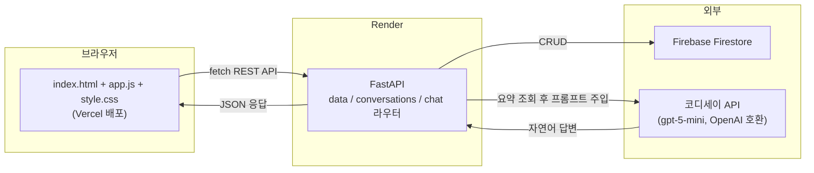
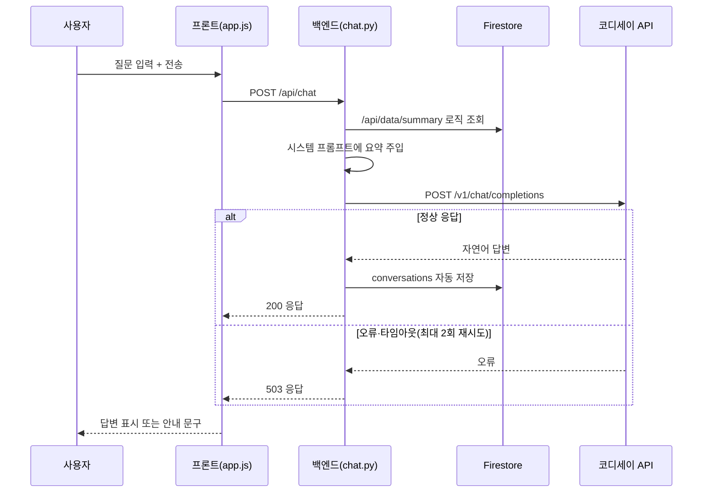

# 온라인 셀러를 위한 네이버 재무건전성 분석 — 결과보고서

| 항목 | 내용 |
|---|---|
| 과제명 | AI Agent 개발: 나만의 AI 비서 구축 (미션과제 M1-2) |
| 분석 주제 | 온라인 셀러를 위한 네이버 재무건전성 분석 AI 비서 |
| 작성 형태 | 개인 프로젝트 (1인 수행) |
| 배포 URL | https://m1-2-nine.vercel.app (프론트) / https://m1-2-xvcs.onrender.com (백엔드) |
| GitHub 저장소 | github.com/ilililililil4319/M1-2 |

## 목차
Ⅰ. 프로젝트 개요
Ⅱ. 분석 질문 (3개 이상)
Ⅲ. 폴더 구조
Ⅳ. 요구사항 대비 최종 구현 결과
Ⅴ. 시스템 구조 및 코디세이 API 연동
Ⅵ. 실행 결과 및 증빙 화면
Ⅶ. 결론 및 한계점
Ⅷ. 오류 처리 이력 정리
Ⅸ. 자체 점검 체크리스트
Ⅹ. 결과 도출 방법 및 최종 제출물
Ⅺ. 기타 — 소감 및 향후 개선 방향

---

## Ⅰ. 프로젝트 개요

본 보고서는 M1-2 미션(AI Agent 개발: 나만의 AI 비서 구축)의 최종 수행 결과를 정리한 문서다. 기획서에서 계획한 내용을 실제로 어떻게 구현했는지, 어떤 결과물이 나왔는지, 그 과정에서 어떤 시행착오가 있었는지를 증빙 화면과 함께 기록한다.

계획대로 금융감독원 Open DART API에서 네이버(NAVER, 035420)의 2020~2025년(24개 분기) 재무제표를 수집·정제하여 성장성·수익성·안정성·현금창출력 4개 영역, 9개 지표의 시계열 데이터를 구축했고, 이를 바탕으로 분석 리포트(REPORT.md)를 작성했다. 또한 이 데이터를 컨텍스트로 활용하는 FastAPI + Firestore 기반 AI 챗봇 웹 서비스(데이터 기반 채팅, CRUD, 대화 기록, 요약 표시 4대 화면)를 구현하여 Render(백엔드)·Vercel(프론트엔드)에 배포하고, 실제 배포 환경에서 정상 동작하는 것을 확인했다. 보너스 과제로 다크모드 토글, CSV/JSON 내보내기, 추가 시각화, 변동성(표준편차) 지표를 추가로 구현했다.

기획서 단계에서 세운 계획과 실제 구현 사이에서 겪은 오류와 해결 과정은 Ⅷ장에서 별도로 정리했다.

- **배포 URL(프론트):** https://m1-2-nine.vercel.app
- **배포 URL(백엔드 Swagger):** https://m1-2-xvcs.onrender.com/docs
- **GitHub 저장소:** https://github.com/ilililililil4319/M1-2

**주요 산출물**
- 분석 리포트 REPORT.md — 데이터 설명, 시계열 분석, 시각화 3종, 인사이트 3개, AI 사용 로그
- 분석 코드 notebook/prepare_data.ipynb
- 웹 서비스 backend/(FastAPI, Render 배포), frontend/(바닐라 JS, Vercel 배포)
- GitHub 저장소 — 코드, 데이터, 문서, 증빙 스크린샷 전체 업로드

---

## Ⅱ. 분석 질문 (3개 이상)

1. 네이버의 성장성·수익성·안정성 지표는 지난 6년간 어떤 추세를 보였는가?
2. 안정성 지표(부채비율·유동비율)에 급격한 변화가 있었던 분기가 있으며, 어떤 이슈와 연결되는가?
3. 위메프 사태처럼 "정산 지연" 리스크를 미리 포착할 수 있는 재무적 신호(현금흐름 급감, 유동비율 하락 등)가 나타난 적이 있는가?

세 질문에 대한 답은 각각 Ⅵ장의 시각화·인사이트(①→질문1, ②→질문2, ③→질문2·3)에서 데이터 근거와 함께 확인할 수 있다.

---

## Ⅲ. 폴더 구조

README.md(루트)와 본 결과보고서(docs/)가 각각 어디에 위치하는지 포함해 전체 폴더 구조를 정리하면 다음과 같다.

```
M1-2/
├── README.md
├── REPORT.md
├── .gitignore
│
├── data/
│   ├── naver_financials_raw.csv
│   └── naver_financials.csv
│
├── docs/
│   ├── 1_기획서_네이버_재무건전성_분석.pdf
│   ├── 1_기획서_네이버_재무건전성_분석.md
│   ├── 2_결과보고서_네이버_재무건전성_분석.pdf   ← 본 문서
│   └── 2_결과보고서_네이버_재무건전성_분석.md    ← 본 문서
│
├── notebook/
│   └── prepare_data.ipynb
│
├── output/
│   ├── 01_revenue_profit_trend.png
│   ├── 02_stability_ratios.png
│   └── 03_operating_cashflow.png
│
├── screenshots/                       # 86장 이상
│
├── backend/                            # Render 배포 루트
│   ├── main.py
│   ├── requirements.txt
│   └── app/ (core, models, routers, services)
│
└── frontend/                           # Vercel 배포 루트
    ├── index.html
    ├── style.css
    └── app.js
```

---

## Ⅳ. 요구사항 대비 최종 구현 결과

| 요구사항 | 구현 위치 | 달성 |
|---|---|:---:|
| 데이터 100개 이상 + 출처/기간 명시 | data/naver_financials.csv (212개, DART) | ✅ |
| 분석 질문 3개 이상 | Ⅱ장 | ✅ |
| 결측치/이상치 확인 및 처리 | REPORT.md 3장 | ✅ |
| 시계열 기법 2개 이상 적용 | 이동평균·YoY·변동성(3개) | ✅ |
| 시각화 2개 이상 | output/*.png(3개) | ✅ |
| 인사이트 3개 이상(Fact-Why-Action) | REPORT.md 6장 | ✅ |
| 데이터 기반 AI 채팅 | POST /api/chat | ✅ |
| 데이터 관리 CRUD | /api/data (5종) | ✅ |
| 대화 기록 저장·불러오기 | /api/conversations (5종) | ✅ |
| 배포 및 문서화 | Render+Vercel, Swagger /docs, README | ✅ |
| API 키 미노출 | .env + .gitignore + 플랫폼 환경변수 | ✅ |
| 보너스(다크모드·내보내기·추가시각화·변동성지표) | frontend/, data_service.py | ✅ |

---

## Ⅴ. 시스템 구조 및 코디세이 API 연동

### 1) 전체 아키텍처



### 2) AI 챗봇 요청 시퀀스



### 3) 코디세이 API 연동 코드

```python
client = OpenAI(
    api_key=os.getenv("CODYSSEY_API_KEY"),
    base_url="https://copa.codyssey.kr/v1",
    http_client=httpx.Client(trust_env=False),
)
```

API 키는 프론트엔드 코드에는 전혀 등장하지 않으며, 백엔드 서버(Render)의 환경변수(`os.getenv`)로만 접근한다.

---

## Ⅵ. 실행 결과 및 증빙 화면

### 데이터 수집·정제

| API 키 발급 | 재무제표 수집 | 결측치 처리 완료 |
|:---:|:---:|:---:|
|  |  |  |

### 시각화 3종

| 매출·영업이익 추이 | 부채비율·유동비율 추이 | 영업활동현금흐름 추이 |
|:---:|:---:|:---:|
|  |  |  |

### Firestore 연동 및 CRUD

| Firebase 프로젝트 생성 | Firestore 연동 확인 | Swagger CRUD 테스트 |
|:---:|:---:|:---:|
|  |  |  |

### AI 챗봇 동작 확인

| 챗봇 엔드포인트 추가 | 실제 질문-응답 성공 |
|:---:|:---:|
|  |  |

### 4대 화면(프론트엔드) 동작 확인

| 채팅 | 데이터 관리 |
|:---:|:---:|
|  |  |

| 대화 기록 | 요약 표시 |
|:---:|:---:|
|  |  |

### 배포 완료 확인

| Render 백엔드 배포 성공 | Vercel 프론트엔드 배포 성공 |
|:---:|:---:|
|  |  |

| 실제 배포 URL 채팅 동작 | 실제 배포 URL 요약 표시 |
|:---:|:---:|
|  |  |

---

## Ⅶ. 결론 및 한계점

### 결론

- 분석 기간(2020~2025) 동안 네이버의 매출·영업이익은 꾸준한 우상향 추세를 보였다.
- 부채비율은 2021년 상반기 이후 구조적으로 낮아진 뒤 안정적으로 유지되고 있으며, 이는 재무구조 악화가 아니라 라인-야후재팬 경영통합에 따른 연결범위 변경이 원인이었다.
- 영업활동현금흐름은 2024년 이후 뚜렷하게 확대되어, 온라인 셀러 입장에서 정산 여력과 직결되는 긍정적 신호로 해석된다.
- 분석 기간 동안 위메프 사태처럼 정산 리스크로 이어질 만한 재무적 경고 신호는 관찰되지 않았다.

### 한계점

- 분석 대상은 네이버 법인 전체(전사) 연결재무제표이며, 스마트스토어(커머스 부문)만 분리된 재무제표는 존재하지 않는다.
- 부채비율 급락과 실제 사건의 연결은 시기적 일치를 근거로 한 해석이며, 통계적 인과관계 검증은 아니다.
- 데이터가 분기 단위 스냅샷이라 분기 사이 단기 이슈는 반영되지 않는다.
- 본 분석은 일반적인 재무 데이터 해석이며, 특정 시점의 입점 여부를 지시하는 투자·경영 조언이 아니다.

---

## Ⅷ. 오류 처리 이력 정리

| 오류 | 원인 | 해결 |
|---|---|---|
| GitHub push 거부(Push Protection) | 재발급 전 옛 Firebase 서비스 계정 키가 커밋 이력에 포함 | 이미 폐기(Google 자동 사용중지)된 키임을 확인 후 unblock, 파일 삭제 |
| 코디세이 API 호출 시 `'ascii' codec can't encode` | httpx가 Windows 환경변수를 자동으로 읽다가 인코딩 실패 | `httpx.Client(trust_env=False)`로 환경변수 자동 읽기 차단 |
| 챗봇 응답이 빈 문자열 | `max_tokens=800`이 낮아 추론 모델이 답변 전 토큰 소진 | `max_tokens=2000`으로 상향 |
| Render 빌드 실패(requirements.txt 못 찾음) | Root Directory 미지정 + requirements.txt 미커밋 | Root Directory를 backend로 지정, 파일 신규 생성 후 push |
| 프론트 로컬 테스트 "Failed to fetch" | index.html을 file://로 직접 열어 CORS에 막힘 | Live Server(http://)로 실행 |
| 배포 사이트 "Failed to fetch" | Render ALLOWED_ORIGINS에 Vercel 주소 미포함 | 환경변수에 Vercel 주소 추가 후 재배포 |

---

## Ⅸ. 자체 점검 체크리스트

- [x] 데이터 100개 이상 + 출처/기간 명시
- [x] 분석 질문 3개 이상
- [x] 결측치/이상치 처리 및 근거 서술
- [x] 시계열 기법 2개 이상 적용
- [x] 시각화 2개 이상(권장 3개)
- [x] 인사이트 3개 이상, Fact-Why-Action 구조
- [x] 데이터 기반 AI 채팅 정상 동작
- [x] 데이터 관리 CRUD 정상 동작
- [x] 대화 기록 저장·불러오기 정상 동작
- [x] Swagger UI(/docs) 접속 확인
- [x] 실제 배포 URL 동작 확인(Render+Vercel)
- [x] AI 사용 로그 작성
- [x] API 키 미노출
- [x] (보너스) 다크모드·CSV/JSON 내보내기·추가시각화·변동성지표 정상 동작

---

## Ⅹ. 결과 도출 방법 및 최종 제출물

| 구분 | 내용 |
|---|---|
| 분석 리포트 | REPORT.md |
| 코드 | notebook/prepare_data.ipynb, backend/, frontend/ |
| GitHub 저장소 | github.com/ilililililil4319/M1-2 |
| 웹 서비스 | https://m1-2-nine.vercel.app (프론트)<br/>https://m1-2-xvcs.onrender.com (백엔드) |
| 문서(docs/) | 기획서(PDF+md), 결과보고서(PDF+md, 본 문서) |
| README(루트) | README.md |

---

## Ⅺ. 기타 — 소감 및 향후 개선 방향

데이터 정제 단계에서 결측치를 기계적으로 처리하는 것보다 "왜 그 값이 비었는지"를 확인하는 과정이 훨씬 중요하다는 것을 체감했다. 부채비율 급락처럼 극적인 변화를 발견했을 때도, 곧바로 결론을 내리지 않고 실제 사건을 웹 검색으로 검증한 뒤에만 반영한다는 원칙을 지켰다.

배포 과정에서는 로컬과 배포 환경의 차이(Root Directory 설정, 환경변수 반영 시점, CORS 정책)로 인한 오류를 여러 차례 겪었는데, 오류 메시지를 정확히 읽고 원인을 좁혀나가는 디버깅 습관을 기를 수 있었다.

**향후 개선 방향**
- 네이버 사업부문별(커머스·핀테크·콘텐츠) 세부 공시 반영으로 스마트스토어 부문에 더 가까운 분석 보강
- 여러 이커머스 플랫폼 재무 데이터 비교 기능 추가
- 챗봇 응답에 근거 데이터 출처(구체적 분기·수치)를 인용 형태로 명시하도록 프롬프트 개선

---

*본 결과보고서는 M1-2 미션(AI Agent 개발: 나만의 AI 비서 구축)의 결과물로 작성되었습니다.*
